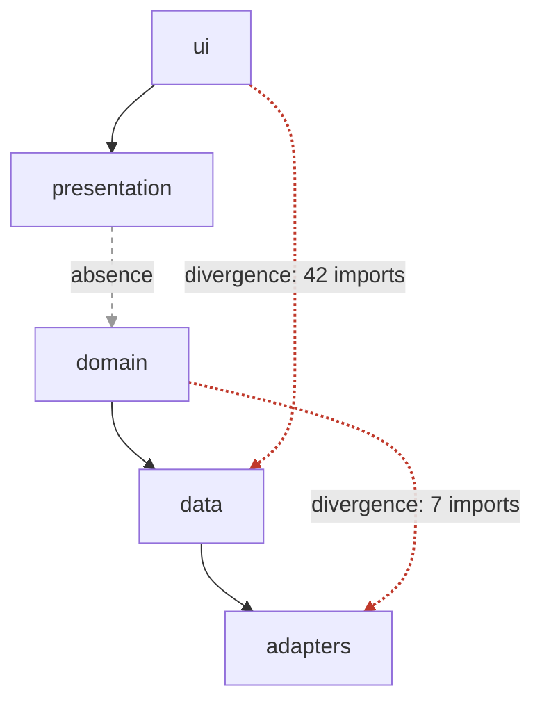

# Recovering the as-is architecture: graphs, reflexion, metrics, git history

Use this file before you design into an existing codebase (SKILL.md Build step 0) and at the start of every
architecture review ([review-playbook.md](review-playbook.md)). The goal is a short, evidence-backed picture of the
architecture the code *actually has*, kept separate from the architecture people *say* it has. Everything
downstream (findings, ADRs, fitness functions) is only as good as this picture.

Keep two classes of statement apart: **as-is** (a claim about the code at a named commit, always with evidence) and
**intended / to-be** (what docs, the team, or your proposal say the structure should be; mark it as such). The gap
between them is the architectural debt; never blur it by describing intent in the present tense.

## 1. Outputs, timebox, evidence

### What to produce

Sketch one view per structure category (SAiP: module, component-and-connector, allocation). Each answers a different
question; do not merge them into one "box diagram".

| View | Question | Recover these elements |
|---|---|---|
| **Module** (static) | What are the implementation units, and what depends on what? | Build units (Gradle/Maven modules, packages, workspaces, crates), package tree, uses/dependency edges, layer order, cycles |
| **C&C** (runtime) | What runs, and how do the running parts talk? | Entry points (`main`, servlets, handlers, lambdas, activities), processes/services, connectors (HTTP, gRPC, queues, DB drivers, sockets, in-process event buses, flows/channels), threads/coroutines/goroutines, external systems, data stores |
| **Allocation** | Where does it run, how is it built and shipped, who owns it? | Deployment units (images, APKs, jars, functions), environments, config and secret sources, CI stages, module-to-artifact mapping, code ownership |

Also name explicitly: the **composition root(s)** (where objects are wired together), every **external system**, and
every **data store** with its owning module.

### Timebox

| Depth | Budget | Covers | Stop when |
|---|---|---|---|
| **Skim** | ~15 min | §2 steps 1-4 and 10; a module list and a guessed layer order | You can name the build units, entry points and composition root |
| **Pass** | ~1 h | All of §2, a tool-generated module graph (§4-5), one scenario trace (§6), churn top 20 (§11) | You can draw the three views and list 3-5 suspected divergences |
| **Deep dive** | half day+ | Reflexion model (§8), metrics (§10), change coupling (§11), 2-3 traced scenarios | Every finding in the report has level-A or level-B evidence |

State the depth you ran in the output block (§13). Never present a skim as a full recovery.

### Evidence levels and citation

This table is the single definition of the A-D scale; [review-playbook.md](review-playbook.md) and the report template
use the same levels.

| Level | Meaning | Cite as |
|---|---|---|
| **A: tool-verified** | Produced by a command over the whole codebase | Command + trimmed excerpt of output + commit SHA |
| **B: read in code** | You opened the file and saw it | `path/to/File.kt:120-134` (+ SHA once per report) |
| **C: inferred** | From names, folder layout, docs, comments, config | "inferred from `docs/arch.md`" or "inferred from package names"; flag as unverified |
| **D: reported** | A person or ticket said so | Who/where; never the sole basis for a high-severity finding |

Record `git rev-parse --short HEAD` once, at the start. Line numbers without a SHA rot.

## 2. Quick-pass checklist (10 steps)

Run in order. Each step names what to look for and the signal that matters.

1. **Manifests and build graph.** Find every build file (§3). List build units and their declared inter-unit edges.
   This is the most reliable module view you will get; start here, not in `src/`.
2. **Entry points.** `main` functions, `Application` subclasses, Android manifest activities/services, `server.ts` /
   `index.ts` / `app.listen`, `if __name__ == "__main__"`, ASGI/WSGI `app` objects, `cmd/*/main.go`, `Program.cs`,
   lambda/function handlers, CLI `bin` entries in `package.json` or `[project.scripts]`.
3. **Composition root / DI.** Where are implementations bound to interfaces? Koin `module { single { } }` /
   `startKoin`, Hilt `@Module` + `@InstallIn`, Dagger `@Component`, Spring `@Configuration` / `@Bean` / component scan,
   NestJS `@Module({ providers })`, FastAPI `Depends(...)`, Go/Rust/manual wiring in `main`. Global singleton signals:
   Kotlin `object` holding state, `lateinit var` at top level, `companion object { lateinit var instance }`,
   `getInstance()`, module-level mutable globals in Python/TS, Go package-level `var db *sql.DB`, `!!` on a global app
   reference. Many singletons = the composition root is implicit and every consumer is coupled to it.
4. **Package tree.** `tree -d -L 3 src` (or `find src -type d | head -100`). Note naming schemes (by layer:
   `controllers/services/repositories`; by feature: `orders/`, `billing/`; by port/adapter). Folder names are
   hypotheses, not evidence (§14).
5. **External systems via import grep.** Grep for client libraries: HTTP (`ktor.client`, `okhttp`, `retrofit`,
   `axios`, `fetch(`, `requests`, `httpx`, `net/http`), brokers (`kafka`, `amqp`, `nats`, `sqs`, `pubsub`), SDKs
   (`aws-sdk`, `firebase`, `stripe`). Record which modules import them: that set is the de-facto adapter layer.
   Directories that talk to external systems, with file counts (extend the pattern to the stack):

   ```bash
   rg -l -e 'okhttp|retrofit|ktor\.client|axios|requests|httpx|net/http|kafka|amqp|nats|aws-sdk|firebase|stripe|jdbc|exposed|sqlalchemy|prisma|gorm' \
      -g '!**/test/**' -g '!**/tests/**' -g '!**/*_test.go' \
   | sed -E 's#/[^/]+$##' | sort | uniq -c | sort -rn
   ```
6. **Persistence ownership.** Find DB drivers/ORMs (`jdbc`, `exposed`, `room`, `sqldelight`, `hibernate`, `prisma`,
   `typeorm`, `sqlalchemy`, `django.db`, `database/sql`, `gorm`, `EntityFramework`) and migrations. Which modules touch
   which tables? More than one writer per table, or several services on one schema, is a key finding.
7. **Concurrency model.** Coroutine scopes and dispatchers, `Thread`/`ExecutorService`, `async`/`await`, worker
   threads, `asyncio`, Celery/RQ workers, `go func`, channels, actors, schedulers/cron. Note shared mutable state
   reachable from more than one of them.
8. **Deployment artifacts.** `Dockerfile*`, `docker-compose*.yml`, Helm charts, k8s manifests, Terraform/Pulumi/CDK,
   `serverless.yml`, SAM/CloudFormation, Procfile, `fly.toml`, app store build config, CI files
   (`.github/workflows/`, `.gitlab-ci.yml`, `Jenkinsfile`).
9. **Test layout.** Unit vs integration vs e2e directories, fakes/mocks, test fixtures that start real infra
   (Testcontainers, docker-compose in CI). Which modules have no tests? Existing architecture tests (ArchUnit,
   Konsist, dependency-cruiser rules, import-linter contracts) are an explicit statement of intent: read them.
10. **Existing intent.** `docs/adr/`, `doc/architecture*`, arc42/C4/Structurizr files, `README*`, `CONTRIBUTING*`,
    `CLAUDE.md`, `AGENTS.md`, `CODEOWNERS`. This is your hypothesized model for §8, not a description of the code.

## 3. Files to read per ecosystem

| Ecosystem | Read | Module edges come from |
|---|---|---|
| Gradle (JVM/Android) | `settings.gradle(.kts)`, each `build.gradle(.kts)`, `gradle/libs.versions.toml`, `buildSrc/` or `build-logic/` convention plugins | `include(":a", ":b:c")` gives the units; `implementation(project(":x"))` / `api(project(":x"))` / `projects.x` give edges (`projects.x` type-safe accessors exist only if `settings.gradle(.kts)` has `enableFeaturePreview("TYPESAFE_PROJECT_ACCESSORS")`; still a feature preview, so version-dependent). `api` leaks the dependency to consumers |
| Kotlin Multiplatform | as Gradle, plus `kotlin { sourceSets { ... } }` | Source sets (`commonMain`, `jvmMain`, `androidMain`, `iosMain`, `wasmJsMain`) and their `dependencies { }`; `expect`/`actual` declarations mark the platform seam |
| Maven | root `pom.xml` `<modules>`, each module `pom.xml`, `<dependencyManagement>` | `<dependency>` on sibling `groupId:artifactId` |
| npm / pnpm / yarn | root `package.json` `workspaces`, `pnpm-workspace.yaml`, each package `package.json` | `dependencies` on `workspace:*` or sibling names; `tsconfig.json` `paths` and `references`; `nx.json` + `project.json` tags; `turbo.json` pipelines |
| Python | `pyproject.toml` (`[project]`, `[tool.poetry]`, `[tool.importlinter]`), `setup.cfg`, `src/` layout, `requirements*.txt` | Imports only (packages rarely declare internal edges); `[tool.importlinter]` contracts if present |
| Go | `go.mod`, `go.work`, `cmd/`, `internal/`, `pkg/` | Imports; `internal/` is compiler-enforced visibility; `go.work` lists local modules |
| .NET | `*.sln`, each `*.csproj`, `Directory.Build.props`, `Directory.Packages.props` | `<ProjectReference Include="..\X\X.csproj" />` |
| Rust | root `Cargo.toml` `[workspace] members`, each crate `Cargo.toml` | `[dependencies] x = { path = "../x" }` or `x.workspace = true` |

## 4. Dependency graph commands

Prefer the build tool's own graph for module edges and a language-level tool for package edges. These are commands
whose behaviour is stable across recent versions; flags do drift, so **verify against the installed version**
(`--help`) before quoting output in a report.

**JVM**

```bash
./gradlew projects                                              # module tree
./gradlew :app:dependencies --configuration runtimeClasspath    # KMP: e.g. jvmRuntimeClasspath
./gradlew :app:dependencyInsight --dependency okhttp --configuration runtimeClasspath
mvn dependency:tree                                             # add -pl <module> to scope
jdeps -summary -recursive -cp 'libs/*' app.jar                  # jar-to-jar
jdeps -verbose:package -cp 'libs/*' app.jar                     # package-to-package
jdeps --dot-output out/ -verbose:package app.jar                # .dot files for Graphviz
```

`jdeps` reads compiled bytecode, so it sees every real type reference. It misses reflection, DI-container wiring and
`ServiceLoader` (§14), compile-time constants that javac/kotlinc inline (`static final` primitives and Strings,
`const val`), and source-retention annotations. If it aborts on missing classes, add `--ignore-missing-deps` (recent
JDKs); for multi-release jars add `--multi-release <jdk-version>`. Check `jdeps --help` on the installed JDK.

**TypeScript / JavaScript**

```bash
npx madge --circular --extensions ts,tsx src/                   # cycles; add --ts-config tsconfig.json for paths
npx madge --extensions ts,tsx --image graph.svg src/            # needs Graphviz installed
npx -p dependency-cruiser depcruise src --include-only "^src" --output-type dot | dot -T svg > deps.svg
npx nx graph                                                    # Nx workspaces; project-level graph
```

The npm package is `dependency-cruiser`; `depcruise` is only its binary, so use `npx -p dependency-cruiser depcruise`
unless it is already a devDependency. It needs a config for rules; recent versions create one with
`npx -p dependency-cruiser depcruise --init`. It also has
folder-level reporters (`--output-type ddot`, `archi`, or `--collapse "^src/[^/]+"`) that collapse file edges for you;
check `--help` of the installed version.

**Python**

```bash
pydeps mypkg --max-bacon 2 --cluster          # needs Graphviz; --noshow to only write the file
pydeps mypkg --show-cycles
lint-imports                                  # import-linter, if [tool.importlinter] contracts exist
```

**Go, .NET, Rust**

```bash
go list -f '{{.ImportPath}}: {{join .Imports " "}}' ./...
go mod graph                                   # module-level (third-party) requirements
dotnet list package --include-transitive       # NuGet deps; `dotnet list X.csproj reference` for project refs
cargo tree --workspace -e no-dev               # add -d to find duplicate versions
```

Go forbids import cycles between packages, so look instead at layer direction (does `internal/domain` import
`internal/postgres`?), at `internal/` boundaries, and at service-level cycles over the network.

### Grep fallback (no tool installed, or mixed-language repo)

Produce `from -> to` pairs at package granularity, then aggregate. Kotlin/Java example. Take `from` from each file's
`package` directive, never from its path: Kotlin packages need not match folders, and the Kotlin coding conventions
recommend omitting the common root package from the directory tree (`src/main/kotlin/ui/X.kt` holds
`package com.acme.ui`). Set `K` (package segments kept) and `NS` (internal namespace) for the repo:

```bash
# 1. file -> package, from the package directive
rg --no-heading --no-line-number --with-filename -o -r '$1' \
   '^package\s+([A-Za-z0-9_.]+)' -g '*.kt' -g '*.java' . > pkgmap.txt
# 2. imports, joined to the importing file's package
rg --no-heading --no-line-number --with-filename -o -r '$1' \
   '^import\s+(?:static\s+)?([A-Za-z0-9_.*]+)' -g '*.kt' -g '*.java' . \
| awk -F: -v K=4 -v NS='^com\\.acme\\.' '
    function trunc(s,   n, i, p, out) {             # first K non-empty segments
      n = split(s, p, "."); out = ""
      for (i = 1; i <= K && i <= n; i++) if (p[i] != "") out = out (out == "" ? "" : ".") p[i]
      return out
    }
    NR == FNR { pkg[$1] = $2; next }
    ($1 in pkg) {
      n = split($2, t, "."); to = ""                # drop class, static member, or *
      for (i = 1; i <= n; i++) { if (t[i] ~ /^[A-Z*]/) break; to = to (to == "" ? "" : ".") t[i] }
      from = trunc(pkg[$1]); to = trunc(to)
      if (to != "" && from != to && to ~ NS) print from " -> " to   # internal cross-package edges only
    }' pkgmap.txt - | sort | uniq -c | sort -rn > edges.txt
```

Limits: the class is detected by its leading uppercase letter, so Kotlin imports of top-level functions or properties
(`import com.acme.util.formatDate`) keep the member name as a segment; truncation to `K` hides this only when the package
already has `K` or more segments. Files in the default package (no `package` line) are skipped. Same-package references need no
import and never appear, which is what you want at this granularity.

Other languages, same pipeline with a different pattern:

| Language | Pattern (`-r '$1'`) | Note |
|---|---|---|
| Python | `^\s*(?:from\|import)\s+([\w.]+)` | Relative imports (`from . import x`) need resolving against the file's package |
| TS/JS | `from\s+['"]([^'"]+)['"]` and `require\(['"]([^'"]+)['"]\)` | Resolve `./` and `../` against the file path; map `tsconfig` `paths` aliases |
| Go | prefer `go list` above | |
| C# | `^using\s+([\w.]+);` | Namespaces need not match folders |

## 5. Collapse the file graph into an architecture graph

File-level graphs are unreadable past ~50 nodes. Map each node to an architectural element with an ordered regex
table (first match wins), aggregate, and count edges. Write the regexes against the node format your §4 tool emitted:
file paths (madge, dependency-cruiser, pydeps) or dotted package names (grep fallback, `jdeps -verbose:package`,
`go list`). Regexes of the wrong form silently map every edge to `unmapped` and give an empty graph.

| Regex on path nodes | Regex on package nodes | Element |
|---|---|---|
| `^app/src/.*/ui/` | `\.ui(\.\|$)` | `ui` |
| `^app/src/.*/(viewmodel\|presentation)/` | `\.(viewmodel\|presentation)(\.\|$)` | `presentation` |
| `^core/domain/` | `\.domain(\.\|$)` | `domain` |
| `^core/data/\|/repository/` | `\.(data\|repository)(\.\|$)` | `data` |
| `^infra/\|/(db\|http\|kafka)/` | `\.(infra\|db\|http\|kafka)(\.\|$)` | `adapters` |
| `.*` | `.*` | `unmapped` (inspect; should shrink to near zero) |

```bash
# edges.txt: "<count> <from> -> <to>" (paths or package names, as produced in §4)
# map.tsv:   "<regex>\t<element>", regexes written against those node names (unescaped | in awk)
awk 'NR==FNR { re[++n] = $1; el[n] = $2; next }
     function m(p,  i) { for (i = 1; i <= n; i++) if (p ~ re[i]) return el[i]; return "unmapped" }
     { a = m($2); b = m($4); if (a != b) w[a " -> " b] += $1 }
     END { for (e in w) print w[e], e }' FS='\t' map.tsv FS=' ' edges.txt | sort -rn
```

Reading the collapsed graph:

- **Layer order**: sort elements by fan-out minus fan-in. Top layers have high fan-out, low fan-in (UI, entry
  points); bottom layers the reverse (domain model, utilities, platform). Any edge from a lower element to a higher one
  is a candidate layering violation; its edge count tells you whether it is one stray import or a design.
- **Thin vs thick edges**: 1-3 imports across a boundary are usually fixable in an afternoon; hundreds mean the
  boundary does not exist.
- **Hubs**: one element with both high fan-in and high fan-out (`common`, `utils`, `core`, `AppState`) is a change
  amplifier; see §10.
- Draw it as Mermaid with edge weights as labels; see [documentation.md](documentation.md) for notation.

## 6. Component-and-connector evidence (runtime)

The module graph says what *compiles against* what. Runtime structure can differ sharply (one module may run as three
processes; two modules may only talk over a queue).

1. **Entry points → components.** Each deployable process, function, or app with its own `main` is a component.
2. **Connectors.** Grep and record type, direction, sync/async, and payload format:

   | Connector | Grep signals |
   |---|---|
   | HTTP/RPC out | `HttpClient`, `WebClient`, `RestTemplate`, `Retrofit`, `axios`, `fetch(`, `requests.`, `httpx.`, `http.NewRequest`, `grpc.Dial` / `grpc.NewClient` |
   | HTTP in | `@RestController`, `routing {`, `app.get(`, `router.`, `@app.get`, `APIRouter`, `http.HandleFunc`, `MapGet` |
   | Messaging | `KafkaProducer`, `@KafkaListener`, `amqp`, `channel.basicPublish`, `SQS`, `SNS`, `PubSub`, `nats.`, `publish(`, `subscribe(`, `emit(`, `on(` |
   | DB | driver/ORM names from §2 step 6; connection strings in config |
   | Streaming/sockets | `WebSocket`, `socket.io`, `SSE`, `EventSource`, Ktor `webSocket {` |
   | In-process async | `Flow`, `StateFlow`, `SharedFlow`, `Channel`, `EventBus`, `LiveData`, RxJava/RxJS `Subject`, Node `EventEmitter`, Go channels |

3. **Concurrency.** For each component: thread pools, dispatchers, event loops, worker counts. Mark shared mutable
   state touched from more than one execution context.
4. **Trace 1-3 key scenarios end to end.** Pick the scenarios tied to the top quality-attribute concerns (the
   checkout, the sync, the login). Start at the entry point and follow calls until the response leaves the system.
   At every boundary crossed (module, process, network, thread, transaction) note: file:line, connector, sync/async,
   timeout/retry present?, error handling. A trace table is itself strong level-B evidence for performance and
   availability findings (see [quality-attributes-runtime.md](quality-attributes-runtime.md)).
5. **Use runtime data when it exists.** Distributed traces or service maps (OpenTelemetry, Jaeger, Zipkin, APM
   dashboards), API gateway or ingress route tables, service mesh configs. These show real call graphs, including
   edges the code hides behind configuration.
6. **Data ownership.** Read migrations (`db/migration/`, `alembic/versions/`, `prisma/migrations/`, `migrations/`)
   and schema files. Map each table to the module or service that writes it. Tables written by two services are a
   shared-database integration, whatever the diagrams say.

## 7. Allocation view

| Recover | Where |
|---|---|
| Deployment units | Dockerfiles (`COPY`/`CMD` show which module ships), Helm/k8s `Deployment`s, serverless functions, mobile/desktop artifacts |
| Module → artifact | Build files (`application { mainClass }`, `jar`/`shadowJar`, `bin`, `[project.scripts]`, `cmd/*`), Dockerfile build stages |
| Environments | Compose profiles, Helm values per env, Terraform workspaces, `.env.*`, CI deploy jobs |
| Config and secrets | Env vars read in code (`System.getenv`, `process.env`, `os.environ`, `os.Getenv`), config files, secret managers (Vault, AWS/GCP secret managers, k8s `Secret`), hard-coded values (a finding) |
| CI stages | Build → test → scan → package → deploy; which checks gate merge; whether architecture tests run |
| Ownership | `CODEOWNERS`, `git shortlog` per directory (§11) |

Note modules that ship in several artifacts and artifacts assembled from several teams' modules (deployability).

## 8. Reflexion model

Murphy, Notkin and Sullivan (1995) compare a hypothesized high-level model with the source via an explicit mapping:

1. **Hypothesized model**: the intended elements and allowed edges (from docs, ADRs, architecture tests, or the team).
2. **Mapping**: path regexes → elements (the §5 table).
3. **Compute**: collapse extracted edges through the mapping and compare.

| Result | Meaning | Action |
|---|---|---|
| **Convergence** | Edge in model and in code | Record; it is an allowed edge in the rule set the fitness function enforces |
| **Divergence** | Edge in code, not in model | Finding; cite edge count and 1-3 example file:line |
| **Absence** | Edge in model, not in code | Either the model is wrong or a feature bypasses the intended path; investigate |

Iterate: when a divergence is a modelling mistake, refine the model or mapping, and say which you changed.



Present intended and actual side by side (two subgraphs) when the audience needs to see the whole debt at once.
Encode the hypothesized model's allowed-dependency rules as an architecture test, with today's divergences recorded
as a frozen baseline (ArchUnit `FreezingArchRule`, dependency-cruiser known violations, import-linter
`ignore_imports`; see [fitness-functions.md](fitness-functions.md)), so the divergence count can only go down. A test
that only asserts existing convergences catches no new divergence.

## 9. Style detection

Signals suggest a style; confirm against the edges ([architectural-patterns.md](architectural-patterns.md)).

| Code signal | Probable style | Confirm by |
|---|---|---|
| `ports/`, `adapters/`, `application/`, `domain/`; interfaces in domain, implementations in adapters | Ports and adapters (hexagonal) / clean | Domain imports no framework or adapter package |
| `controllers/`, `services/`, `repositories/` | Layered (often "by-layer" packaging) | No upward edges; layer-skipping edges (controller → repository) are documented bridges if relaxed layering was chosen, otherwise violations |
| `features/<name>/` each with its own ui/data | Feature-sliced / vertical slices | Cross-feature imports are rare and go through public APIs |
| `EventBus`, `publish/subscribe`, broker clients, `@EventListener` | Event-driven / publish-subscribe | Publishers do not know subscribers; check for request/reply hidden in events |
| `ServiceLoader`, plugin dirs, `entry_points`, dynamic `import()` / `require` of paths from config | Microkernel / plug-in | A stable core API; plug-ins depend on core only |
| Folders per business capability, each with `api` + `internal` subpackages or modules | Modular monolith | Cross-module imports only hit `api` |
| Several deployables, each with own DB schema, talking over HTTP/queues | Microservices / service-based | Independent deploy pipelines; no shared tables |
| Several services, one schema/DB | Distributed monolith (shared database) | Migration ownership; cross-service joins |
| `Pipeline`, `Stage`, stream operators, shell-pipe-style chains, Beam/Flink jobs | Pipe-and-filter | Filters share no state |
| One `Store`, reducers, actions, unidirectional flow | Redux/MVI-style | Views never mutate state directly |
| Terraform/Helm/Compose placing deployables in separate networks or subnets | Multi-tier | Which tier can reach which (security groups, network policies) |
| MVC/MVP/MVVM naming in UI code | UI patterns | ViewModel has no reference to views; see [design-patterns-in-code.md](design-patterns-in-code.md) |

Mixed signals are normal. Report the dominant style per subsystem, not one style for the repo.

## 10. Metrics: where to look, not verdicts

Metrics point your reading. Never report a number as a finding on its own; pair it with the code it points to and
the quality attribute it threatens.

### Martin's package metrics

| Metric | Definition | Read as |
|---|---|---|
| **Ca** (afferent) | Elements outside that depend on this one | Responsibility: many dependants make change costly |
| **Ce** (efferent) | Elements outside this one depends on | Dependence: many dependencies make it fragile |
| **I** (instability) | Ce / (Ca + Ce), 0 = stable, 1 = unstable | Stable Dependencies Principle: depend in the direction of decreasing I |
| **A** (abstractness) | Abstract types / total types in the element | Stable Abstractions Principle: stable elements should be abstract |
| **D** (distance) | \|A + I − 1\| | Distance from the main sequence |

**Zone of pain** (A≈0, I≈0): concrete and heavily depended on, so painful to change (a concrete `utils` everyone
imports, a shared DB schema). **Zone of uselessness** (A≈1, I≈1): abstractions nobody depends on. Martin counts
classes; at module granularity count modules and say so.

```python
# usage: python3 martin.py < edges.txt   (lines: "[count] from -> to")
import sys
from collections import defaultdict
ca, ce, mods = defaultdict(set), defaultdict(set), set()
for line in sys.stdin:
    p = line.split()
    if "->" not in p: continue
    k = p.index("->"); a, b = p[k - 1], p[k + 1]
    mods |= {a, b}
    if a != b: ce[a].add(b); ca[b].add(a)
rows = []
for m in mods:
    n_a, n_e = len(ca[m]), len(ce[m])
    rows.append((n_e / (n_a + n_e) if n_a + n_e else 0.0, m, n_a, n_e))
for i, m, n_a, n_e in sorted(rows):
    print(f"{m:40} Ca={n_a:3} Ce={n_e:3} I={i:.2f}")
```

Abstractness caveats: Go interfaces are satisfied implicitly and usually declared by the consumer, so A per package
is misleading; in TypeScript count interfaces and abstract classes as abstract, but decide whether data-shape
interfaces and `type` aliases (DTOs) count, since they inflate A, and note that structural typing lets
implementations skip importing the interface, so Ca of interface-only modules is undercounted; Kotlin `sealed` hierarchies and Rust traits need a decision on how to count.
State your counting rule or skip A and D.

### Cycles

Compute strongly connected components on the collapsed graph (`networkx.strongly_connected_components` over the §5
output). madge `--circular` and pydeps `--show-cycles` report file/module-level cycles; map their members through §5
before reporting. Report each SCC larger than one element with its members and
the thinnest edge to cut. Cycles between modules defeat independent build, test and release.

### Size and complexity

| Tool | Gives | Example |
|---|---|---|
| `scc`, `tokei`, `cloc` | LOC per language/dir; `scc` also a complexity estimate | `scc --by-file -s complexity src` |
| `lizard` | Cyclomatic complexity (CCN), function length; many languages | `lizard -w -C 15 src/` (warnings above CCN 15) |
| `radon` | Python CC and maintainability index | `radon cc -s -a mypkg`, `radon mi mypkg` |
| `gocyclo` | Go CC | `gocyclo -over 15 .` |
| `detekt` | Kotlin complexity and style rules | Gradle plugin; read its report's complexity section |

Thresholds are heuristics: McCabe suggested 10 per function; many teams flag 15-20; files over ~500-1000 lines in a
hotspot deserve a look. Complexity only matters where code changes (§11).

### Cohesion signals

- **Internal/external edge ratio** per element: imports that stay inside ÷ imports that leave. A low ratio suggests
  the boundary cuts through a concept.
- **LCOM** variants disagree with each other and punish data classes and DTOs; use only as a rough pointer to classes
  that are really two classes.
- **Co-change** (§11) is the strongest cohesion signal: files that always change together belong together.

### Connascence (Page-Jones)

A vocabulary for coupling strength. Static forms, weaker to stronger: name, type, meaning (magic values), position,
algorithm. Dynamic forms: execution order, timing, value, identity. Rules: prefer weaker forms, keep strong forms
local (inside a module), and reduce degree (how many elements share it). Use it to explain *why* a cross-module edge
is dangerous ("both services must agree on the meaning of status code 7").

## 11. Git history (behavioural analysis)

Tornhill's point: the code that matters is the code that changes. Combine history with structure.

**Churn** (commits touching each file, last 12 months):

```bash
git log --since=12.month --format=format: --name-only | grep -v '^$' | sort | uniq -c | sort -rn | head -50
```

12 months is the default window (the report template assumes it). Shorten to 3-6 months for fast-moving repos, and
state the window in the output block.

**Hotspots** = churn × size or complexity. Join the churn list with `scc --by-file` or `lizard` output; the top 10 by
product are where modifiability findings pay off first. A complex file nobody touches is low priority.

**Change coupling** with code-maat (JAR name and version vary by release; build or download per its README):

```bash
git log --all --numstat --date=short --pretty=format:'--%h--%ad--%aN' --no-renames --after='12 months ago' > git.log
java -jar code-maat-<version>-standalone.jar -l git.log -c git2 -a coupling          # degree, avg revs
java -jar code-maat-<version>-standalone.jar -l git.log -c git2 -a revisions
java -jar code-maat-<version>-standalone.jar -l git.log -c git2 -a entity-ownership
```

code-maat can aggregate files into architectural elements with `-g groups.txt`, one `<path-prefix or ^regex$> =>
<element>` per line (regex support depends on the version; check its README). Convert the §5 path-form mapping into
that format; `map.tsv` cannot be passed as-is.

**Pure git/awk co-change fallback** (pairs of files committed together; skips huge commits):

```bash
git log --since=12.month --no-merges --format='@@%h' --name-only \
| awk '
  function flush(   i, j, k) {
    if (n > 1 && n <= 30)
      for (i = 1; i <= n; i++) for (j = i + 1; j <= n; j++) {
        if (f[i] < f[j]) k = f[i] " <-> " f[j]; else k = f[j] " <-> " f[i]
        pair[k]++
      }
    n = 0
  }
  /^@@/ { flush(); next }
  NF    { f[++n] = $0 }
  END   { flush(); for (k in pair) print pair[k], k }' \
| sort -rn | head -30
```

Change coupling across module boundaries (or across services/repos) with no static edge between them is hidden
coupling: shared assumptions, duplicated logic, or a protocol in two places. It is often the best finding in a review.

**Ownership**: `git shortlog -sn HEAD -- path/to/module` (pass `HEAD`; without a revision, shortlog reads stdin when
not on a terminal). Many small contributors on a hotspot = coordination cost; one contributor = bus-factor risk.

Caveats:
- Squash merges collapse many changes into one commit: coupling looks stronger, churn lower.
- Bulk reformat, license-header, and mass-rename commits inflate churn; exclude them (`--invert-grep --grep=...` or
  by SHA) or cap commit size as the awk script does.
- Renames split a file's history unless you follow them; code-maat recommends `--no-renames`, so moved files appear as
  new ones. Check `git log --follow` for key files.
- Exclude generated and vendored files (`build/`, `dist/`, `*.lock`, `*_pb.*`, `generated/`) before ranking.
- A young repo or a single-author repo gives weak signals; say so.

## 12. From metrics to quality-attribute claims

| Observation | Tentative claim | QA (see) | Confirm before reporting |
|---|---|---|---|
| Upward edges / skip-layer edges in collapsed graph | Layering not enforced; changes ripple across layers | Modifiability, testability ([quality-attributes-change.md](quality-attributes-change.md)) | Open 2-3 edges; check they are production code |
| SCC spanning modules | Modules cannot be built, tested or released independently | Modifiability, deployability | Find the thinnest edge to cut |
| High Ca, low A (zone of pain) | Every change to it is expensive | Modifiability | Check its churn: pain only if it changes |
| Hotspot: high churn × high complexity | Defect-prone, slow to change | Modifiability, reliability | Read the file; check bug-fix commit share |
| Cross-module co-change without static edge | Hidden coupling (shared meaning/format) | Modifiability, integrability | Identify the shared assumption |
| Domain imports framework/DB/HTTP types | Domain not portable or unit-testable | Testability, portability | Confirm in domain source set, not tests |
| Two writers on one table / one schema, many services | Shared-DB integration | Modifiability, availability, deployability | Migration ownership |
| Synchronous chain of 3 or more remote hops on one request path in a key scenario (R2) | Latency and availability multiply along the chain | Performance, availability ([quality-attributes-runtime.md](quality-attributes-runtime.md)) | Timeouts, retries, circuit breakers present? |
| Global mutable singletons accessed from many threads | Races, hidden coupling, untestable | Reliability, testability | Access paths and synchronisation |
| Secrets in code or config committed to git | Credential exposure | Security | `git log -S` for the value |
| One-author hotspot | Knowledge concentration | (Organisational risk) | Ownership share over time |

## 13. Output block

Paste into [../templates/architecture-review-report.md](../templates/architecture-review-report.md) or design notes; write "not checked", never blank.

```markdown
### As-is architecture (recovered)
- Commit: `<sha>` · Depth: skim | pass | deep dive · Tools: <gradle projects, madge 8.x, ...>
- Build units: <list> · Entry points: <file:line, ...> · Composition root: <file:line or "implicit: N singletons">
- External systems: <name → connector → module> · Data stores: <store → owning module(s)>
- Deployment units: <artifact ← modules> · Environments: <list> · Config/secrets: <sources>
- Dominant style(s): <style per subsystem, with confirming evidence>
- Module view: <Mermaid collapsed graph, edge counts as labels>
- Layer order (by fan-in/fan-out): <top → bottom>
- Reflexion vs <intended model source>: convergences N · divergences N (top 3 with counts + file:line) · absences N
- Cycles: <SCCs with members>
- Hotspots (churn × complexity, window: <12 months>): <top 5 files>
- Hidden coupling (co-change without static edge): <top pairs>
- Unverified (level C/D) claims: <list>
```

## 14. Pitfalls

- **Judging by folder names.** `domain/` that imports Spring, `repositories/` that render HTML. Names are level-C
  evidence; the edges decide.
- **Edges the static graph misses.** Reflection, DI containers (Spring component scan, Hilt, Koin `get()`),
  `ServiceLoader`, annotation processing/KSP/kapt output, Python `importlib`, JS dynamic `import()` and `require` of
  computed paths, Go `plugin`, string-keyed event buses, HTTP calls to your own services. Grep for these and add the
  edges by hand, marked as such.
- **Edges the static graph over-counts.** Test-only dependencies (`testImplementation`, `devDependencies`,
  `*_test.go`, `tests/`), type-only imports (`import type` in TS), and doc/sample code. Exclude tests from the
  production graph; analyse them separately.
- **Generated code.** Protobuf/OpenAPI clients, Room/SQLDelight/Prisma output, Compose resources. Include as a node
  if it is a real boundary; exclude from size and churn rankings.
- **Build variants and targets.** Android flavors/build types, KMP targets, Go build tags, TS `paths` per project,
  feature flags. An edge may exist only in one variant; name the variant you analysed.
- **Monorepo scope.** Tools run from a sub-package see only that package; run from the root or per package and
  merge.
- **Treating metrics as verdicts.** High instability is correct for UI and entry points; zone of pain is fine for a
  stable standard library. Always tie a number to a quality-attribute scenario before it becomes a finding.
- **Describing intent as fact.** If the only source is a README or diagram, the claim is level C, however confident it
  sounds.

Structure vocabulary (§1) follows SAiP's module / C&C / allocation categories. Theory adapted in part from the
Wikipendium TDT4240 compendium (CC BY-SA 3.0); see [../CREDITS.md](../CREDITS.md).
