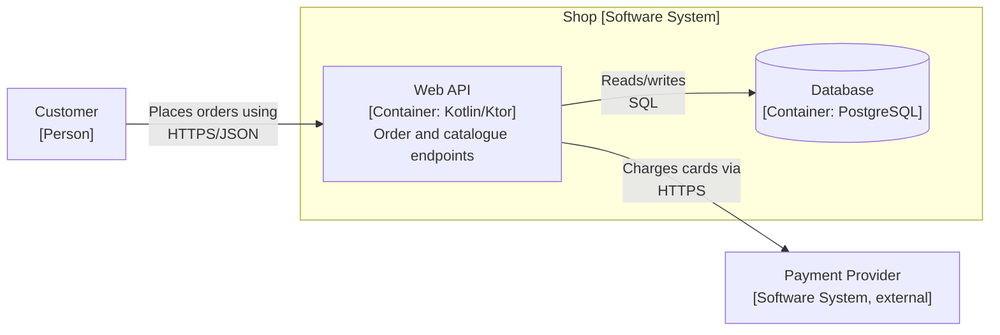
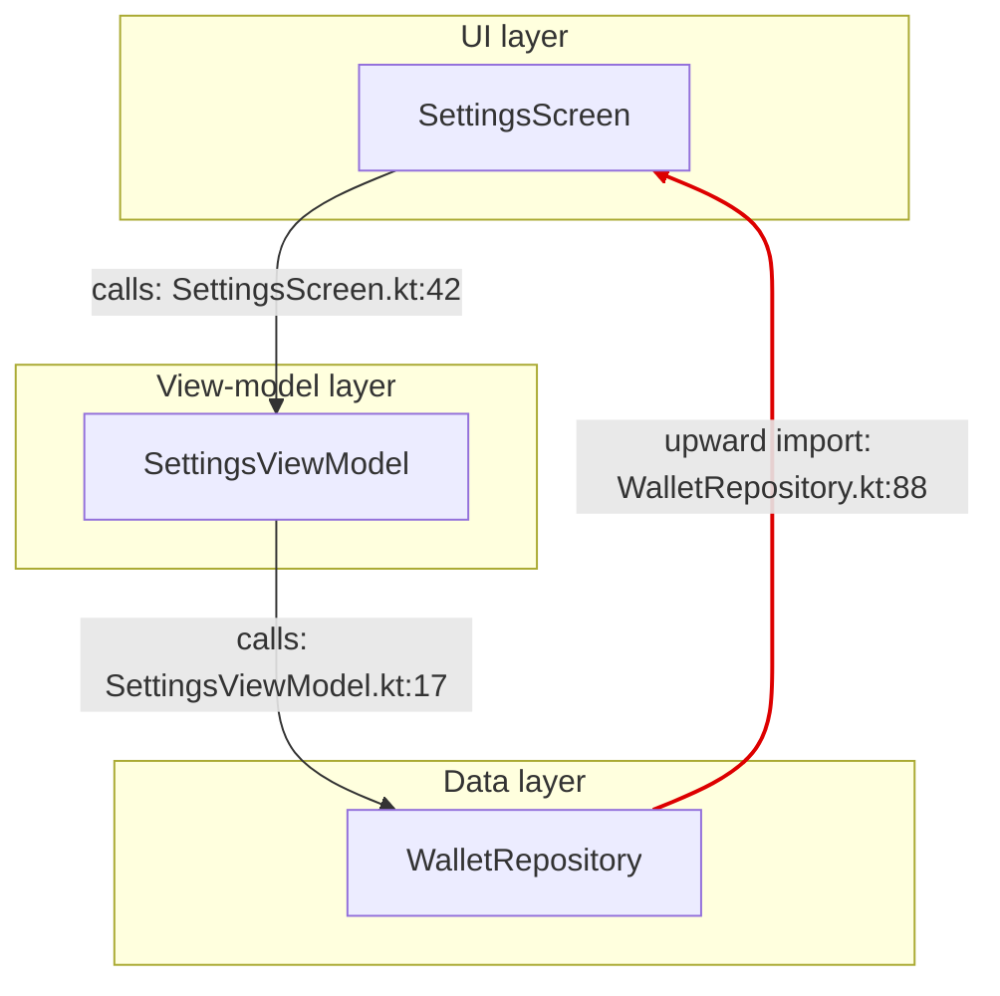

# Pragmatic architecture documentation: 42010, Views and Beyond, 4+1, arc42, C4, ADRs, docs-as-code

Load this file when asked to document an architecture, write or review an architecture description (AD), draw
architecture diagrams, or set up ADRs. It tells you which deliverable and framework to use for which request (§1a),
what the minimum useful document is, and how to keep it true to the code. Related files (not repeated here): the design procedure that produces the
content in [design-workflow.md](design-workflow.md); recovering the as-is structure in
[architecture-recovery-and-metrics.md](architecture-recovery-and-metrics.md); pattern catalogue per view type in
[architectural-patterns.md](architectural-patterns.md); quality-attribute scenarios in
[quality-attributes-runtime.md](quality-attributes-runtime.md) and
[quality-attributes-change.md](quality-attributes-change.md); executable rules in
[fitness-functions.md](fitness-functions.md); skeletons in
[../templates/architecture-description.md](../templates/architecture-description.md) and
[../templates/adr.md](../templates/adr.md).

Theory adapted in part from the Wikipendium TDT4240 compendium (CC BY-SA 3.0).

---

## 1. Principles (apply to every document you write)

1. **Write for a named reader and their concern.** Before writing a section, state who reads it and what question it
   answers. A section that answers nobody's question is deleted, not polished. (This is the first of the Views and
   Beyond rules for sound documentation; the others, paraphrased: do not repeat yourself, remove ambiguity by
   explaining your notation, use a standard organisation readers can navigate, record rationale, keep it current but
   do not chase every commit, and review the document with its intended readers.)
2. **Minimal set first.** Start with: quality goals, context diagram, building-block (container/module) view, 1-3
   runtime scenarios, decisions, risks. Add views only when a stakeholder's concern is unanswered.
3. **Docs as code.** Keep the AD in the repository (`docs/architecture.md` or `docs/architecture/`), in Markdown or
   AsciiDoc, diagrams as text (Mermaid, Structurizr DSL, PlantUML), reviewed in the same PRs as the code it describes.
   Wikis and slide decks drift; a file next to the code at a known commit does not drift silently.
4. **Mark every statement descriptive or prescriptive.** **AS-IS** = a claim about the code at a named commit;
   **TO-BE** = a proposal, marked *Proposed*. Never let intended architecture read as if it were the current one.
5. **AS-IS statements cite code.** Name the file (and line or symbol) each claim is drawn from, and pin the baseline
   (commit hash or version) at the top of the document.
6. **Generate diagrams where possible.** Diagrams of module dependencies should come from the recovered graph
   (section 6.5), not from memory. Hand-drawn diagrams are for intent (context, target architecture) only.
7. **Every diagram has a title, a key, and labelled arrows.** Say what a box is and what an arrow means ("calls",
   "depends on at compile time", "sends events to"). Unlabelled boxes-and-lines are the most common documentation defect.

---

## 1a. Procedure: pick the deliverable, then build it

**Step 1: match the request to the smallest deliverable that answers it.** Do not produce a full 12-section arc42 or a
complete Views and Beyond package unless the request calls for one.

| Request | Deliverable | Sections to use |
|---|---|---|
| "Explain this repo to a new developer" / "document this repo" | arc42 sections 1, 3, 5, 6 + C4 L1 context and L2 container diagrams + ADRs for the 2-3 biggest embodied decisions | §5, §6, §7 |
| "Record this decision" | One ADR, nothing else | §7, [../templates/adr.md](../templates/adr.md) |
| "Review our architecture document" | Findings against the checklist | §11, §10 staleness checks |
| Multi-team, regulated or contract-bound system | 42010 stakeholder/concern table + V&B view template for each view + correspondence tables | §2, §3 |
| "Is our documentation complete?" | Map each section to a 4+1 view and the §8 view map; report gaps | §4, §8 |
| "Draw a diagram of X" | One diagram at one C4 level, with title, key, labelled arrows, element catalogue | §6 |

**Step 2 (existing codebase): build the AD from evidence.**

1. Pin the baseline: `git rev-parse --short HEAD` (and the release tag, if any) at the top of the document.
2. Recover the module graph with [architecture-recovery-and-metrics.md](architecture-recovery-and-metrics.md) §4-5;
   render it collapsed (§6.5) for the building-block view.
3. Container view: read build files (`settings.gradle.kts`, `package.json` workspaces, `go.mod`, `pyproject.toml`) and
   deploy manifests (Dockerfiles, `docker-compose*.yml`, Helm/K8s, Terraform, CI deploy jobs).
4. Runtime view: grep the concurrency and messaging entry points (§4 grep list) and trace 1-3 key scenarios as
   sequence diagrams.
5. Decisions: reconstruct embodied ADRs from code and `git log` (e.g. `git log --diff-filter=A --format='%h %cs %s' --
   <build file or module dir>` for when a module or dependency arrived); mark them "Reconstructed".
6. Write intended vs actual structure (§9), with violating edges and file:line evidence.
7. Add a risks table tracing each risk to its causing decision.
8. Start from Part 2 of [../templates/architecture-description.md](../templates/architecture-description.md).

---

## 2. ISO/IEC/IEEE 42010 (and IEEE 1471-2000)

IEEE Std 1471-2000 (*Recommended Practice for Architectural Description of Software-Intensive Systems*) was
superseded by ISO/IEC/IEEE 42010:2011, revised as 42010:2022. The standard prescribes **what an AD must identify**,
not which views or notations to use. Use it as the framing and conformance checklist; use arc42/C4 for structure.

| Concept | Meaning; how to apply it |
|---|---|
| **Stakeholder** | Person, team or organisation with an interest in the system. Include maintainers, operators, security reviewers, release engineers, integrators, not only users. |
| **Concern** | An interest a stakeholder has (e.g. "can a feature team change pricing rules without touching checkout?"). Phrase concerns as questions the AD answers. |
| **Viewpoint** | The conventions for constructing and using a kind of view: which concerns it frames, for which stakeholders, with which model kinds, notations and analysis methods. Template-to-instance: viewpoint is to view as class is to object. |
| **View** | The part of the AD that addresses the concerns framed by one viewpoint, for this system. Governed by exactly one viewpoint. |
| **Model kind** (2011+) | Conventions for one type of model inside a viewpoint (e.g. sequence diagram, dependency graph, deployment table). |
| **Model** | A concrete diagram/table/text in a view; a model can appear in more than one view. |
| **Correspondence** (2011+) | A recorded relation between AD elements (module X realises component Y; component Y runs on node Z), optionally governed by a correspondence rule. Generalises 1471's "consistency among views". |
| **Rationale** | Why the architecture is as it is, and why these viewpoints were chosen. Record as ADRs (section 7). |

Chain: **stakeholders have concerns → viewpoints frame concerns → views conform to viewpoints → views contain models →
correspondences relate elements across views → rationale justifies decisions.**

**A conforming AD minimally identifies** (paraphrased): the AD itself and its system (identification, version,
overview); the stakeholders and their concerns; each viewpoint used, with the concerns it frames and why it was chosen;
one view per viewpoint, with its models; correspondences between elements and any **known inconsistencies**; and the
architecture rationale and key decisions. Architecture frameworks (a predefined set of viewpoints for a domain) and
architecture description languages are recognised concepts since 2011.

**2022 revision, stated conservatively:** the title and scope were broadened beyond software-intensive systems to
"entities of interest" (e.g. enterprises, systems of systems), and some terminology was refined. If a claim depends on
a 2022-specific detail, say so and check the standard text; do not cite clause numbers from memory.

**Practical use:** open the AD with a stakeholder/concern table whose third column says *where the concern is
addressed* (section or quality goal). A stakeholder earns a row only by raising a concern some section answers; a
concern with no answer is a gap to report.

---

## 3. Views and Beyond (SAiP 4th ed. ch. 22; Clements et al. 2010)

**Principle:** document the relevant views, then document the information that applies across views. "Relevant"
depends on the readers; there is no fixed list.

### 3.1 View categories (V&B viewtypes)

Module, C&C and allocation are the three viewtypes (SAiP 4th ed. calls them categories of structures and views).
Styles such as decomposition, uses, layered, pub-sub and deployment specialise each viewtype; the last column lists
them.

| Category | Elements and relations | Answers | Examples in code |
|---|---|---|---|
| **Module** | Implementation units (packages, modules, classes, layers); *is-part-of*, *uses*, *depends-on*, *generalises* | Responsibilities, dependency direction, modifiability, work split | Gradle/Maven modules, npm workspaces, Python packages, Go packages; decomposition, uses, layered, data-model styles |
| **Component-and-connector (C&C)** | Runtime components (processes, services, actors, stores) and connectors (RPC, queues, pub-sub, pipes, shared DB) | Runtime behaviour, performance, availability, security, concurrency | Services and their HTTP/gRPC/queue links; client-server, pub-sub, pipe-and-filter, shared-data styles |
| **Allocation** | Software elements mapped to environment (hardware, containers, file systems, teams) | Deployment, cost, ownership, build/install layout | Kubernetes manifests, Terraform, app-store targets, CODEOWNERS (work assignment), install layout |

Normalise loose vocabulary: a SAiP **component** is a *runtime* element; **layers** are a module-view concept;
**tiers** are a C&C or allocation concept (SAiP's multi-tier pattern, depending on how the tiers are defined), so a
3-tier runtime or deployment diagram is not a layered view, and a C&C tier view is not a mistake.

**Quality views** extract, for one quality attribute and audience, the relevant parts of other views: security view
(trust boundaries, where authN/authZ happens, sensitive data flows), performance view (queues, caches, network hops,
latency budgets), reliability view (redundancy, fault detection, failover), communications view, exception/error view
(which element detects and owns which failure).

**Combining views:** overlay views only when the mapping is tight and the result stays readable. Good pairs:
C&C + deployment (processes on nodes), decomposition + work assignment (module = team), decomposition + uses.

### 3.2 The view template (every view you write)

| Part | Content | Failure to catch |
|---|---|---|
| **Primary presentation** | Diagram or table of elements and relations, with a key | Arrows with no stated meaning |
| **Element catalogue** | Each element: responsibility, interfaces, key properties, behaviour; relations and their properties | Diagram labels are the only description |
| **Context diagram** | What is in scope of this view and what is outside, and how they interact | External services missing from the picture |
| **Variability guide** | Variation points (plugins, feature flags, platform targets, swappable adapters) and how to exercise them | Omitted although portability/configurability is a goal |
| **Rationale** | Which quality goals/ADRs drove this shape; rejected alternatives | "We used X because it is best practice" |

### 3.3 Documenting behaviour

| Need | Notation | Use for |
|---|---|---|
| One scenario, across elements | Sequence diagram (Mermaid `sequenceDiagram`) | A request path, a login flow, a failure/retry path |
| Lifecycle of one element | State machine (Mermaid `stateDiagram-v2`) | Sessions, orders, connection managers, protocol handlers |
| Flow of work with branches/parallelism | Activity diagram / flowchart | Pipelines, jobs, onboarding flows |

Traces (sequence/activity) show one path; state machines show all legal behaviour of an element. Number architectural
observations under each runtime diagram ("3. the UI thread blocks here on disk I/O") so reviewers can cite them.

### 3.4 Beyond views (cross-view information)

- **Documentation roadmap and view template:** how the AD is organised, which section answers which concern, and the
  standard parts every view has (§3.2).
- **System overview:** purpose, users, context, constraints, in half a page.
- **Mapping between views:** tables of module ↔ component ↔ node (these are 42010 correspondences).
- **Rationale:** cross-cutting decisions (the ADR index).
- **Directory:** glossary, abbreviations, index; expand every abbreviation at first use.

### 3.5 Choosing views and notation

1. List stakeholders × candidate views; mark detail needed (full / overview / none).
2. Merge marginal views into related ones; drop views nobody needs.
3. Document the views needed earliest first (usually decomposition + context).

Notation: **informal** (boxes and lines + prose; cheap, undefined semantics), **semiformal** (UML, C4 conventions;
widely read, some tool support), **formal** (ADLs such as AADL or Acme; analysable, few readers). Default to
semiformal text-based diagrams plus prose.

---

## 4. Kruchten's 4+1 view model (IEEE Software 12(6), 1995)

| View | Stakeholders | Concerns | Where it lives in a codebase |
|---|---|---|---|
| **Logical** | Users, analysts, domain developers | Functionality, key domain abstractions | Domain packages, entities/aggregates, public interfaces |
| **Process** | Integrators, performance engineers | Concurrency, distribution, throughput, fault tolerance | Threads, coroutine scopes/dispatchers, goroutines, worker pools, queues, services as processes |
| **Development** | Developers, build/release, managers | Module organisation, build dependencies, reuse, work split | `settings.gradle.kts`, `package.json` workspaces, `go.mod`, `pyproject.toml`, directory layout, CODEOWNERS |
| **Physical** | Operators, system engineers | Mapping onto nodes and networks; availability, scalability | Dockerfiles, Helm/K8s manifests, Terraform, CI deploy jobs, mobile/desktop targets |
| **Scenarios (+1)** | All | Show the four views work together; discover and validate the design | End-to-end tests, sequence diagrams of key use cases |

**Correspondences:** logical → process (which abstractions run in which thread/process), logical → development
(domain concepts → packages/modules, not always 1:1), process → physical (processes → nodes, possibly several
configurations such as test vs production). Scenarios are walked through each view to check consistency.

**Use it as a completeness check**, not as a document structure: map each AD section to a 4+1 view; a view with no
section (typically process or physical) is a gap. Tailor: drop the process view for a single-threaded CLI, merge
logical and development views for a small library, but always keep scenarios. Put runtime interactions in the
process view, not the logical view.

**Recovering the process view from code.** Grep for concurrency entry points, then give each match a row in the
process view (what runs there, on which thread/pool/process, what it communicates with):

```sh
git grep -nE 'Executors\.new|ThreadPoolExecutor|new Thread\(' -- '*.java' '*.kt'   # JVM pools/threads
git grep -nE 'CoroutineScope\(|Dispatchers\.|GlobalScope' -- '*.kt'                # Kotlin coroutines
git grep -nE 'go func' -- '*.go'                                                      # goroutines
git grep -nE 'asyncio\.create_task|ThreadPoolExecutor|ProcessPoolExecutor|multiprocessing' -- '*.py'
git grep -nE 'new Worker\(|worker_threads' -- '*.ts' '*.js'                           # JS workers
git grep -nE '@KafkaListener|@RabbitListener|@JmsListener|\.subscribe\(|\.consume\(' # queue consumers
```

Treat matches as leads, not proof: confirm each by reading the surrounding code, and cite file:line in the view.

---

## 5. arc42 (Starke & Hruschka; https://arc42.org/)

Twelve-section open template; use it as the default document structure.

| # | Section | One line |
|---|---|---|
| 1 | Introduction and Goals | Purpose, top 3-5 ranked quality goals, stakeholders |
| 2 | Architecture Constraints | What is given and not negotiable (platform, regulation, org) |
| 3 | Context and Scope | System as black box: users, external systems, interfaces |
| 4 | Solution Strategy | The handful of fundamental decisions and how they reach the quality goals |
| 5 | Building Block View | Static decomposition, refined level by level |
| 6 | Runtime View | Key scenarios as behaviour |
| 7 | Deployment View | Infrastructure and mapping of building blocks onto it |
| 8 | Crosscutting Concepts | Persistence, errors, security, concurrency, i18n, logging |
| 9 | Architecture Decisions | ADR index or ADRs |
| 10 | Quality Requirements | Quality tree and quality scenarios |
| 11 | Risks and Technical Debt | Known liabilities, ordered |
| 12 | Glossary | Shared vocabulary |

**For a small system fill these first:** 1 (goals), 3 (context), 5 (building blocks), 6 (runtime), 9 (decisions),
11 (risks). Leave the rest as headings with "not yet needed" rather than filling them with boilerplate.

---

## 6. C4 model (Simon Brown; https://c4model.com/)

### 6.1 Levels

| Level | Diagram | Shows | Audience |
|---|---|---|---|
| 1 | **System Context** | The system as one box; people and external systems | Everyone |
| 2 | **Container** | Separately runnable/deployable units: apps, services, databases, queues ("container" is not Docker) | Developers, ops |
| 3 | **Component** | Major components inside one container, with responsibilities | Developers |
| 4 | **Code** | Classes/functions of one component | Usually omitted; generate from the IDE if ever needed |

Supplementary diagrams: **system landscape** (all systems in an organisation), **dynamic** (numbered interactions for
one scenario), **deployment** (containers mapped to infrastructure nodes per environment).

**Notation rules:** every element has a name, a type (`[Person]`, `[Software System]`, `[Container: tech]`,
`[Component: tech]`) and a one-line responsibility; every relationship is one-directional and labelled with intent and,
from level 2 down, technology ("Reads orders from [SQL/TCP]"); every diagram has a title and a key; do not mix levels
in one diagram.

### 6.2 Structurizr DSL (minimal workspace)

Keep a `workspace.dsl` in `docs/architecture/`; render with Structurizr tooling (Lite/CLI/on-premises; which to use and
exact rendering commands are version-dependent, so check the current Structurizr docs).

```
workspace "Shop" "Online shop" {
    model {
        customer = person "Customer" "Buys products"
        shop = softwareSystem "Shop" "Sells products online" {
            web = container "Web API" "Order and catalogue endpoints" "Kotlin/Ktor"
            db = container "Database" "Orders and catalogue" "PostgreSQL"
        }
        payments = softwareSystem "Payment Provider" "Card payments (external)"

        customer -> web "Places orders using" "HTTPS/JSON"
        web -> db "Reads from and writes to" "SQL"
        web -> payments "Charges cards via" "HTTPS"
    }
    views {
        systemContext shop "Context" {
            include *
            autolayout lr
        }
        container shop "Containers" {
            include *
            autolayout lr
        }
    }
}
```

### 6.3 Mermaid and PlantUML

Mermaid flowchart equivalent (renders natively on GitHub and GitLab); encode the C4 type in the label:



Mermaid also has dedicated `C4Context` / `C4Container` diagram types; Mermaid's own documentation marks them
experimental, so prefer the flowchart form for anything that must render reliably. For PlantUML, the
**C4-PlantUML** library (github.com/plantuml-stdlib/C4-PlantUML) provides `Person`, `System`, `Container`, `Rel`
macros; include path and bundled version depend on the PlantUML release.

### 6.4 Which level for which question

| Question | Diagram |
|---|---|
| "What does this system talk to?" | Context |
| "What gets deployed and how do the parts communicate?" | Container (+ deployment) |
| "How is this service/app organised inside?" | Component, or a generated module-dependency graph |
| "What happens when X?" | Dynamic or sequence diagram |

### 6.5 Generating diagrams from the recovered graph

Extraction (which tool, which flags, per ecosystem) is owned by
[architecture-recovery-and-metrics.md](architecture-recovery-and-metrics.md) §4, and collapsing a file graph into
architectural elements by §5. Do not re-derive it here. The documentation-specific step is: render a **collapsed**
(module/package-level) graph, commit it next to the AD, and commit the command that regenerates it.

```sh
# TypeScript/JavaScript: folder-level graph via dependency-cruiser (package: dependency-cruiser; binary: depcruise)
npx -p dependency-cruiser depcruise src --include-only "^src" --output-type archi | dot -T svg > docs/architecture/deps.svg
#   alternatives: --output-type ddot (folder level), or --output-type dot --collapse "^src/[^/]+"
# madge scans only .js by default; pass the extensions (and tsconfig for path aliases)
npx madge --extensions ts,tsx --ts-config tsconfig.json --dot src/ > docs/architecture/deps.dot
# Python: keep the graph at package level
pydeps mypackage --max-bacon 2 --cluster --show-dot --no-output > docs/architecture/deps.dot
```

Output-type names and flags vary between tool versions; check `--help` on the installed version. For JVM builds, see
the recovery file's `jdeps` commands: pass dependency jars with `-cp`/`--class-path` or they show as "not found" and
third-party edges silently disappear. For multi-module Gradle builds, take the module-level graph from the build
(`include(...)` in `settings.gradle.kts` and `project(...)` dependencies in each `build.gradle.kts`) and use `jdeps`
only for package-level edges inside one module.

Wire regeneration into the build so the diagram cannot silently age, e.g. a `docs-diagrams` target:

```make
docs-diagrams:
	npx -p dependency-cruiser depcruise src --include-only "^src" --output-type archi | dot -T svg > docs/architecture/deps.svg
```

and a CI job that runs `make docs-diagrams` and fails on `git diff --exit-code docs/architecture/` (or uploads the
fresh SVG as an artifact).

---

## 7. Architecture Decision Records

**Format (Nygard, "Documenting Architecture Decisions", 2011,
https://www.cognitect.com/blog/2011/11/15/documenting-architecture-decisions):** Title, Context (forces,
value-neutral), Decision ("We will ..."), Status, Consequences (everything that follows, good and bad). Many templates
move Status to the top. **MADR** (Markdown
Any/Architectural Decision Records, https://adr.github.io/madr/) is a richer alternative with explicit decision drivers
and considered options with pros and cons; its section names differ between MADR versions. Use the project's existing
format if one exists; otherwise use [../templates/adr.md](../templates/adr.md).

**Statuses:** Proposed → Accepted | Rejected; Accepted → Deprecated | Superseded by ADR-NNNN. (Nygard lists
proposed, accepted, deprecated and superseded; Rejected comes from MADR and common practice.) Rejected proposals keep
their record.

**Rules:**
- **Immutable once accepted.** A changed mind is a new ADR that says "Supersedes ADR-NNNN"; edit the old one only to
  set "Superseded by ADR-MMMM". Typo fixes are fine; rewriting the decision is not.
- **Number in order written**, never renumber; present in dependency order in the AD if helpful.
- **Location:** `docs/adr/NNNN-kebab-case-title.md` (four digits). Small CLI tools exist to create and link ADRs;
  they are optional, a text editor suffices.
- Add **Alternatives rejected** (one-line reason each), **Costs accepted**, **Non-goals**, and the **quality goal
  served** and **risks** caused or mitigated.
- **Enforced by:** name the fitness function (test, lint rule, CI job) that keeps the decision true, per
  [fitness-functions.md](fitness-functions.md). A structural ADR without an enforcing check decays.
- **Reconstructed ADRs** for undocumented history: recover from code and git history, mark "Reconstructed", and write
  "accepted by default" when nobody chose deliberately.

**Is it ADR-worthy?** Write one if any is true:

| Signal | Example |
|---|---|
| Hard or expensive to reverse | Database engine, sync vs async messaging, monolith vs services, public API style |
| Changes module/dependency structure | New module, new allowed dependency edge, new layer |
| Trades one quality attribute against another | Caching for latency at the cost of consistency |
| Adds an external system or significant library/framework | Payment provider, DI framework, ORM |
| Sets a cross-cutting convention | Error model, logging/tracing standard, auth approach |
| Reviewers keep asking "why is it like this?" | Any recurring question |

Not ADR-worthy: local refactors, naming, choices reversible in a single PR.

---

## 8. View map across frameworks

Put a version of this table at the top of every AD; it doubles as a completeness check.

| Concern | 42010 | Views and Beyond | 4+1 | arc42 | C4 |
|---|---|---|---|---|---|
| Why the system exists, what "good" means | Stakeholders, concerns | System overview | Scenarios | 1, 10 | - |
| Non-negotiables | Concerns (constraints) | Overview | - | 2 | - |
| System boundary, external interfaces | A context viewpoint you define | Context diagrams | - (implicit in scenarios) | 3 | L1 Context |
| Static decomposition, dependencies | A viewpoint you define (e.g. V&B module viewtype) | Module views | Logical + Development | 5 | L2 Container, L3 Component |
| Runtime behaviour, concurrency | A viewpoint you define (e.g. V&B C&C viewtype) | C&C views, behaviour | Process | 6 | Dynamic |
| Deployment, infrastructure | A viewpoint you define (e.g. V&B allocation viewtype) | Allocation views | Physical | 7 | Deployment |
| Cross-cutting mechanisms | Concerns framed by several viewpoints (no dedicated construct) | Quality views | (all) | 8 | - |
| Decisions and rationale | Rationale, decisions | Rationale | - | 4, 9 | - |
| Cross-view consistency | Correspondences, known inconsistencies | Mapping between views | Correspondences | - | - |
| Risks and debt | (rationale) | - | - | 11 | - |
| Vocabulary | - | Directory | - | 12 | - |

42010 prescribes no particular viewpoints; its cells name where the concern lands once you pick or define one (or
adopt a framework's). 4+1 has no context view; treat the system boundary as outside 4+1.

---

## 9. Case: documenting an existing codebase honestly (Wally wallet, MR 853)

The architecture description proposed in https://gitlab.com/wallywallet/wallet/-/merge_requests/853 documents a
Kotlin Multiplatform wallet app whose single shared module builds for several targets. It is framed as a 42010 AD,
structured by arc42, drawn at C4 levels 1-3 and checked against 4+1. Techniques worth copying, in own words:

| Technique | How it is done | Why it works for an existing codebase |
|---|---|---|
| **Baseline and AS-IS/TO-BE split** | Header pins the app and toolchain versions; AS-IS claims name their source file; TO-BE appears only in proposed ADRs, risks and roadmap, marked *Proposed* | Readers can verify every claim against a commit, and nobody mistakes the target for the present |
| **arc42 + C4 levels + view map** | Sections follow arc42; static views are C4 container and component diagrams; a table maps each section to arc42 #, C4 level, 4+1 view and concern | Familiar structure, and the map shows at a glance which views exist |
| **Ranked quality goals with a conflict rule** | Five six-part QA scenarios with numeric response measures, ranked, plus an explicit rule (the top-ranked security goal wins every conflict, e.g. over responsiveness or reliability; a real tension between testability and the current design is named and argued in the roadmap) | Future tradeoff arguments can be settled by pointing at the rule instead of reopening the debate |
| **Element catalogue under each diagram** | A table of each container (build unit, contents, size) directly below the diagram, followed by the "structural fact worth naming" | Diagrams alone hide scale and responsibility; the catalogue exposes a monolithic module the picture would flatter |
| **"Layering: intended versus actual"** | Two graphs side by side: the intended view → view-model → repository layering and the real call graph, with bypassing edges and one upward dependency highlighted; the upward edge is named a layer-bridging cycle, worse than a shortcut | Documents the gap between rules and code instead of pretending the rules hold; makes the debt concrete and reviewable |
| **ADRs split embodied vs proposed** | ADRs for decisions already in the code are reconstructed (some "accepted by default"); proposals come after, each with quality goal served, costs, alternatives, migration and non-goals, and "Supersedes ADR-NNN" where they replace an embodied one | History and direction can be accepted or rejected one decision at a time; supersession links show exactly what changes |
| **Risk table tied to causing ADRs** | Each risk has a *cause* column naming the ADR that created it and a *mitigation* column naming the ADR that addresses it | Mitigations target causes, not symptoms; each proposal is justified by specific risks |
| **Target architecture + sequenced roadmap** | A target layering and module graph, then phases, each independently valuable and revertible, with prerequisites and goals served; plus an explicit "what deliberately does not change" list | Turns a big rewrite into reviewable steps (strangler-style); non-goals make the proposal safe to accept |
| **Executable-rules ADR** | A proposed ADR turns the rules into CI checks (dependency direction, no global state in UI, data-source types confined to the data module, coverage floor, startup budget), scheduled last so it does not encode a structure not yet reached | Documents do not enforce architecture; builds do. A check added before the target exists is a permanently red build |

Adopt these by default whenever you document a codebase you did not design: pin the baseline, keep AS-IS and TO-BE
apart, show intended vs actual, and trace risks to decisions.

**Intended vs actual layering in Mermaid.** Draw the actual graph with the intended layers as subgraphs, label every
edge with its file:line evidence, and style the violating edge. `linkStyle` takes the 0-based index of the edge in
declaration order:



Put the intended graph (allowed edges only) beside it, and list each violating edge in the risk table.

---

## 10. Keeping documentation honest

**Update triggers.** Require an AD change in the same PR when the PR:
- adds, removes or renames a module/package/service, or adds a dependency edge between modules;
- adds an external system, datastore, queue or third-party service (context and container diagrams);
- accepts, supersedes or deprecates an ADR;
- changes deployment topology, threading/concurrency model, or a cross-cutting mechanism (auth, error model);
- changes a quality goal or its response measure.

**Review docs in PRs.** Add a PR template checkbox ("architecture docs updated / not affected"), put `docs/architecture/`
and `docs/adr/` under CODEOWNERS for the architecture owner, and regenerate dependency diagrams in CI so diffs show
structural change.

**Staleness signals** (report these in reviews):
- Diagram names a module, class or service that no longer exists (grep for it).
- Build files list modules absent from the building-block view.
- Baseline version/commit far behind the current release.
- ADRs "Proposed" for months, or code that contradicts an "Accepted" ADR with no superseding record.
- Generated diagram older than the last change to build files.

**Detecting them:**

```sh
# 1. Diagram elements that no longer exist in code: extract names from Mermaid labels or workspace.dsl, grep each
grep -ohE '(container|component|softwareSystem|person) "[^"]+"' docs/architecture/workspace.dsl | cut -d'"' -f2 |
  while read -r n; do git grep -qF "$n" -- ':!docs' || echo "STALE: $n"; done
# 2. Modules in the build vs the building-block catalogue (compare by eye or with comm)
grep -E '^\s*include\(' settings.gradle.kts        # Gradle
jq -r '.workspaces[]?' package.json                 # npm/yarn workspaces (object form: .workspaces.packages[])
go list ./...                                       # Go packages
# 3. Generated diagram older than the last build-file change (dates, YYYY-MM-DD)
git log -1 --format=%cs -- docs/architecture/deps.svg
git log -1 --format=%cs -- '*build.gradle.kts' package.json go.mod pyproject.toml
```

Names that are display labels ("Web API") rather than identifiers will not grep; for those, check the element
catalogue's code reference instead. A hit only means the string exists, so spot-check that it is still the same
element.

**Ownership.** Name an owner per document (or per section for large systems). Documentation with no owner is
documentation nobody updates.

---

## 11. Reviewer checklist for any architecture document

**Framing (42010)**
- [ ] Identification: title, version, date, status, baseline commit or version, authors.
- [ ] Stakeholders listed with concerns; each concern points to the section that answers it.
- [ ] Each view says which concerns it addresses and why it is included.
- [ ] Correspondences between views given; known inconsistencies recorded.

**Goals and constraints**
- [ ] Quality goals are six-part scenarios with measurable response measures, ranked, with a conflict rule.
- [ ] Constraints kept separate from decisions.

**Views**
- [ ] Context diagram shows all external systems and people.
- [ ] Every diagram has title, key, labelled one-directional arrows; C4 levels not mixed.
- [ ] Each view has primary presentation, element catalogue, context, variability guide where relevant, rationale.
- [ ] Runtime behaviour in sequence/state diagrams, not in the static view; deployment shows nodes and protocols.
- [ ] Layers (module views) not confused with tiers (C&C or allocation views); components mean runtime elements.
- [ ] For existing code: intended vs actual structure compared, violations named with file evidence.

**Rationale and decisions**
- [ ] Significant decisions recorded as ADRs with alternatives rejected, costs accepted, status, supersession links.
- [ ] Structural ADRs name the fitness function that enforces them.
- [ ] Risks traced to causing decisions and to mitigations.

**Honesty and hygiene**
- [ ] AS-IS claims cite code; TO-BE marked *Proposed*.
- [ ] Diagrams consistent with the code at the baseline (spot-check 3 module names and 3 edges).
- [ ] Glossary; abbreviations expanded at first use.
- [ ] Links to ADRs, issues and source files resolve at the baseline commit; external standards cited only where they
  constrain the design.
- [ ] Owner named; update triggers stated.

---

### References

- Bass, L., Clements, P., Kazman, R. *Software Architecture in Practice*, 4th ed., Addison-Wesley, 2021 (ch. 22).
- Clements, P., Bachmann, F., Bass, L., Garlan, D., Ivers, J., Little, R., Merson, P., Nord, R., Stafford, J.
  *Documenting Software Architectures: Views and Beyond*, 2nd ed., Addison-Wesley, 2010.
- Kruchten, P. "The 4+1 View Model of Architecture." *IEEE Software* 12(6):42-50, 1995. DOI 10.1109/52.469759.
- IEEE Std 1471-2000; ISO/IEC/IEEE 42010:2011; ISO/IEC/IEEE 42010:2022.
- arc42: https://arc42.org/ ; C4 model: https://c4model.com/ ; Structurizr: https://structurizr.com/ ;
  ADR resources and MADR: https://adr.github.io/
- Nygard, M. "Documenting Architecture Decisions", 2011,
  https://www.cognitect.com/blog/2011/11/15/documenting-architecture-decisions
- Ford, N., Parsons, R., Kua, P. *Building Evolutionary Architectures*, O'Reilly, 2017.
- Wally wallet architecture description, GitLab MR 853:
  https://gitlab.com/wallywallet/wallet/-/merge_requests/853 (techniques summarised, not copied).
- Wikipendium contributors, "TDT4240 Software Architecture", https://www.wikipendium.no/TDT4240_Software_Architecture
  (CC BY-SA 3.0); parts of sections 2 and 3 adapted with changes. Full attribution in [../CREDITS.md](../CREDITS.md).
