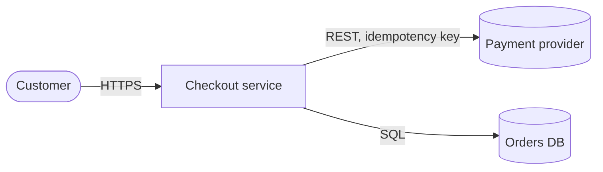
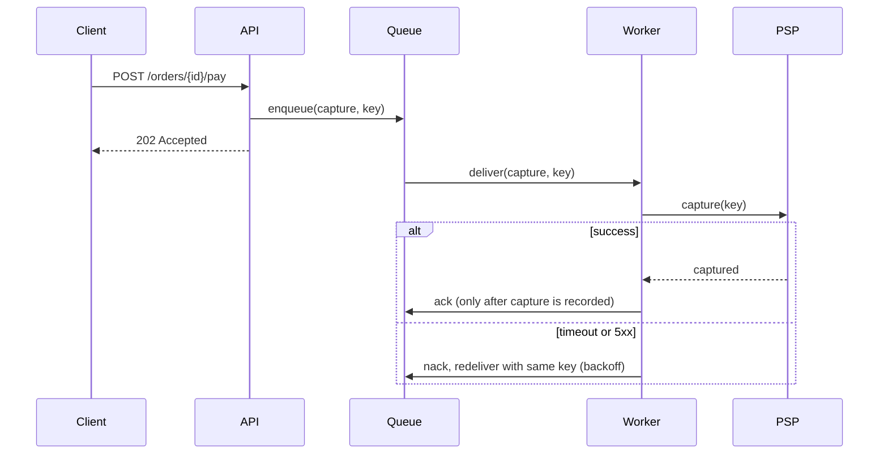
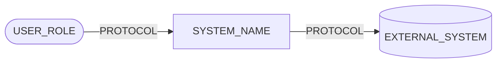
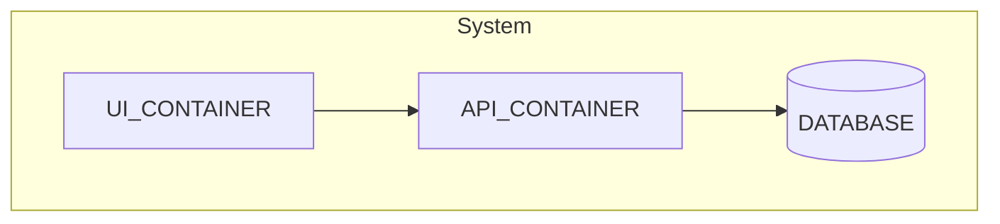
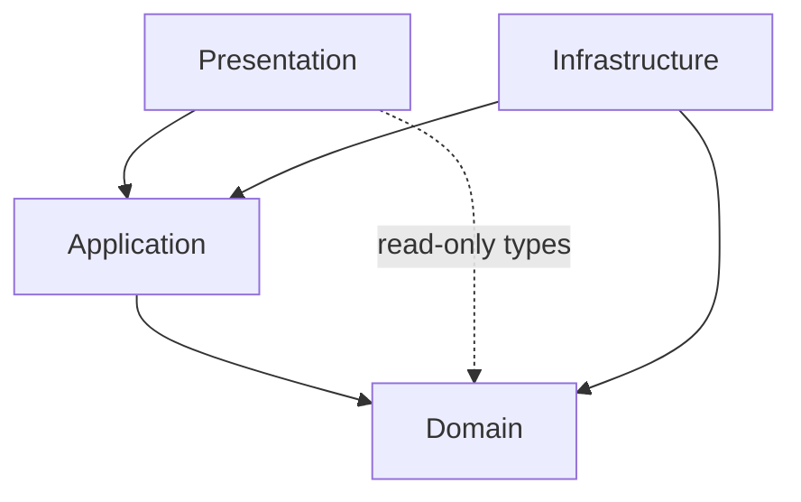
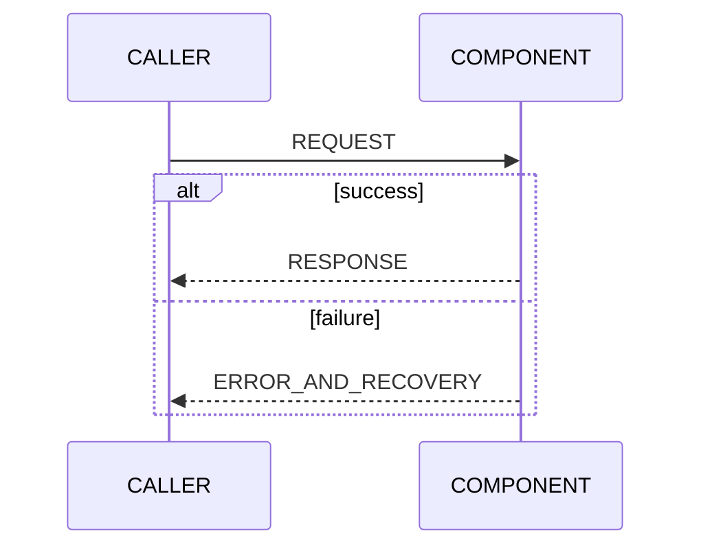

# Template: lean architecture description (arc42 + C4 + 42010) and design-brief variant

Two variants in one file. Pick one and copy the content between its four-backtick fences into the target repo.
Before publishing:
- Delete every guidance note in square brackets. Most start a line (`[...]`); a few sit at the end of a heading or
  table cell. Mermaid node brackets (`sys[Checkout service]`, `db[(Orders DB)]`) and Markdown links are syntax,
  not guidance; keep them.
- Replace every `e.g.` line with real content for this system; never publish the example.
- Replace every `<placeholder>` in prose and tables, and every UPPER_CASE placeholder inside diagrams.
- Delete any section marked *omit if ...* when the condition holds.
- Keep every diagram in its ```` ```mermaid ```` fence so GitHub and GitLab render it.

| Variant | Mode | When | Save as |
|---|---|---|---|
| Part 1: Design brief | BUILD | New feature, service or significant refactor, before writing code | `docs/design/<feature>.md` or inline in the PR |
| Part 2: Architecture description | DOCUMENT | Describe an existing system (as-is) and optionally its target (to-be) | `docs/architecture/README.md` or `ARCHITECTURE.md` |

Method: [documentation.md](../references/documentation.md), [design-workflow.md](../references/design-workflow.md). Tactics: [runtime](../references/quality-attributes-runtime.md), [change](../references/quality-attributes-change.md). Rules: [fitness-functions.md](../references/fitness-functions.md). Decisions: [adr.md](adr.md).
Scenario IDs follow design-workflow.md: `QS-<QA letter><n>` (e.g. `QS-P1`), and `QG-<n>` for ranked quality goals.

---

## PART 1: Design brief

````markdown
# Design brief: <feature or service name>

| Author | Date | Status | Reviewers | Related |
|---|---|---|---|---|
| <name> | <YYYY-MM-DD> | Draft / In review / Accepted / Superseded | <names> | <issue, PR, ADR links> |

## 0. Summary
[Three sentences: the problem, the recommended option, the status. A reader who stops here knows what is proposed.]
e.g. Checkout times out under Black-Friday load; move payment capture behind a queue with idempotent workers; in review.

## 1. Context and scope
[In scope / out of scope as two bullet lists. Then a C4 level-1 context diagram: the system as one box,
people and external systems around it, labelled edges with protocol.]
e.g. Out of scope: refunds (unchanged, still synchronous).



## 2. As-is sketch
[What exists today that this touches, with file references. Recover it, do not recall it:
see ../references/architecture-recovery-and-metrics.md. Name current dependencies and pain points.]
e.g. `checkout/api/OrderController.kt:88` calls `PspClient.capture()` inline inside the DB transaction.

## 3. Drivers
**Functional drivers** [the 1-5 use cases that shape structure, not the full backlog]
e.g. Capture payment exactly once per order, even when the client retries.

**Constraints** [non-negotiables: platform, regulation, budget, team, deadlines, contracts, and the host's process
model: can it run a worker, cron, does it scale to zero]
e.g. Must stay on PostgreSQL 15; no new managed services this quarter.

**Open questions** [3-5 questions whose answers change the structure. In non-interactive runs, list them with the
default you assumed; scenarios and ADRs cite the question IDs they depend on.]

| ID | Question | Why it changes the structure | Default assumed |
|---|---|---|---|
| Q1 | <question> | <what flips if the answer differs> | <ASSUMED value> |

**Quality-attribute scenarios** [3-7, six-part (source, stimulus, artifact, environment, response, response
measure). Mark each CONFIRMED (stakeholder agreed the number) or ASSUMED (you proposed it; needs sign-off).
Copy every ASSUMED value into section 11 as an open question.]

| ID | QA | Source | Stimulus | Artifact | Environment | Response | Measure | Status |
|---|---|---|---|---|---|---|---|---|
| QS-P1 | Performance | Customers | 400 checkouts/s | Checkout API | Peak sale | Accept and enqueue | p99 < 300 ms | ASSUMED |
| QS-A1 | Availability | Payment provider | PSP unreachable for 10 min | Capture path | Normal load | Orders still accepted as `PENDING`, captured later | 0 lost or double captures | CONFIRMED |
| QS-P2 | Performance (resource usage) | Queue backlog | 50k pending captures | Worker process | PSP recovering | Keep draining without crashing | Worker heap < 512 MB | ASSUMED |
| QS-M1 | Modifiability | Product owner | Switch to a second PSP | Payment adapter | Design time | Only a new adapter changes | < 3 dev-days, 0 domain changes | ASSUMED |

## 4. Utility tree
[Quality attribute -> refinement -> scenario ID, each rated (business importance, technical risk) as H/M/L.
Design effort goes to (H,H) first.]
e.g. Availability -> PSP outage tolerance -> QS-A1 (H,H)

## 5. Options considered
[At least two real options, one of which may be "minimal change". Score each against every scenario:
+ satisfies, 0 neutral, - hurts, ? unknown (becomes a risk or spike).]

| Option | QS-P1 | QS-A1 | QS-P2 | QS-M1 | Cost / effort | Notes |
|---|---|---|---|---|---|---|
| A. Queue + idempotent worker | + | + | 0 | + | M | adds broker ops |
| B. Keep inline, add timeouts and retries | - | 0 | + | 0 | S | duplicate-capture risk |

## 6. Decision
[Chosen option and why it wins on the (H,H) scenarios. Per scenario, the tactics used (SAiP names) and, separately,
the patterns applied; do not call a pattern a tactic. Sensitivity points (a parameter a response depends on) and
tradeoff points (a parameter that is a sensitivity point for two or more attributes).]
e.g. QS-A1: retry (availability tactic, recover from faults) wrapped in a circuit breaker (availability pattern);
an idempotency key makes the retry safe (implementation mechanism, not a SAiP tactic).
Tradeoff point: queue depth bounds both enqueue latency (QS-P1) and worker memory (QS-P2).

## 7. Structure
[Package/module tree; allowed-dependency table that matches the tree edge for edge; key interface signatures in the
repo's language; which component owns which data (one writer per table/topic); concurrency model (threads,
coroutines, actors, event loop) and error model (exceptions vs result types, where errors are translated).
See ../references/module-layout-and-interfaces.md.]

```text
checkout/
  api/             -> application
  application/     -> domain
    ports/         interfaces the application needs; implemented by adapters
  domain/          (no outward deps)
  adapters/        -> application.ports, domain
  bootstrap/       -> all (composition root: wiring only; nothing depends on it)
```

| From \ To | api | application (incl. ports) | domain | adapters |
|---|---|---|---|---|
| api | - | yes | no | no |
| application | no | - | yes | no |
| domain | no | no | - | no |
| adapters | no | ports only | yes | - |
| bootstrap | yes | yes | yes | yes |

e.g. Interface: `interface PaymentGateway { suspend fun capture(orderId: OrderId, key: IdempotencyKey): CaptureResult }` in `application/ports/`
e.g. Data: `payments` table written only by `CaptureWorker`; `api` reads it through `OrderQuery`.
e.g. Concurrency: workers are coroutines on a bounded dispatcher (parallelism 8); no shared mutable state outside the DB.
e.g. Errors: adapters map PSP HTTP errors to `CaptureResult.Declined | CaptureResult.Retryable`; no exception crosses the application boundary.

## 8. Runtime
[1-2 sequence diagrams for the scenarios that drove the decision. Show the failure path in an `alt` block,
not in message text.]



## 9. Rollout
[Feature flags and their default; expand/contract schema migration steps (add, dual-write, backfill, switch reads,
remove); rollback plan and the point after which rollback is no longer cheap.]
e.g. Flag `checkout.async_capture` off by default; enable per region; rollback = flag off, queue drains.

## 10. Fitness functions
[One executable rule per structural decision. Name the actual check, not a list of candidate tools. Equivalents for
import-linter, dependency-cruiser, Konsist and others: ../references/fitness-functions.md.]

| Rule | Check | Where it runs | Scenario protected |
|---|---|---|---|
| domain imports nothing from adapters | ArchUnit: `noClasses().that().resideInAPackage("..domain..").should().dependOnClassesThat().resideInAPackage("..adapters..")` | `./gradlew test` in the CI merge-request pipeline | QS-M1 |

## 10b. Verification results
[Commands run and their results, as level-A evidence: build, type check, tests, fitness functions, against the base
SHA. If the repo could not be modified, the scratch copy's path and the throwaway services used.]
e.g. `uv run pytest tests/notifications` in /tmp/scratch-abc123 (base `abc123`, Postgres 16 + Mailpit containers): 14 passed.

## 11. Risks, open questions, deliberately not doing
[Risks: what could make a scenario fail. Open questions: owner and due date; every ASSUMED value from section 3
goes here. Not doing: explicit non-goals so reviewers do not ask.]
e.g. Open question: QS-P1 p99 < 300 ms is ASSUMED; confirm with the product owner by <date>.
e.g. Not doing: exactly-once delivery from the broker; idempotency in the worker covers it.

## 12. ADRs created
[List ADR files created or superseded by this brief.]
e.g. `docs/adr/0014-async-payment-capture.md` (Proposed)

<!-- keep in sync with SKILL.md Build step 8 -->
## Self-check before asking for review
- [ ] Every scenario has a response measure and a CONFIRMED or ASSUMED status; every ASSUMED value is in section 11 with an owner and a date.
- [ ] At least two options were scored against the scenarios; the rejected option's reason is written down.
- [ ] Each scenario maps to named tactics (and patterns, labelled as such), and each to a module or interface in section 7.
- [ ] The allowed-dependency table matches the package tree and is enforced by a fitness function in section 10.
- [ ] Data ownership, concurrency and error model are stated, not implied.
- [ ] Rollout has a flag or migration path and a rollback plan.
- [ ] Sensitivity and tradeoff points, risks and non-goals are listed; each significant decision has an ADR.
- [ ] Code skeletons compile and the fitness functions pass (or fail only on the known, listed divergences); section 10b
      records the commands and results.
````

---

## PART 2: Architecture description

<!-- Structure modelled on the Wally wallet architecture description: https://gitlab.com/wallywallet/wallet/-/merge_requests/853 -->

````markdown
# <System name>: Software Architecture Description

| | |
|---|---|
| **System** | <name and one-line purpose> |
| **Repository** | <URL or path> |
| **Baseline** | <commit SHA or tag>; <key framework/runtime versions> |
| **Status** | Draft / In review / Approved (<date>) |
| **Audience** | <maintainers, reviewers, operators, new joiners> |
| **Purpose** | (a) Descriptive: the architecture as it is at the baseline; (b) Prescriptive: target and migration path [drop (b) if not applicable] |

## About this document
[Conformance statement, one bullet each; keep only what you actually follow.]
- Architecture description in the sense of ISO/IEC/IEEE 42010 (state the edition, 2011 or 2022; the 2022 revision
  changed parts of the terminology): stakeholders, concerns, viewpoints, views, rationale.
- Section structure follows arc42 (adapted; see the view map).
- Static views use C4 levels 1-3 (context, container, component); level 4 (code) is left to the code.
- Completeness checked against Kruchten 4+1 (logical, process, development, physical + scenarios).
- Quality goals are six-part quality-attribute scenarios; design responses are named tactics and patterns (Bass,
  Clements, Kazman, *Software Architecture in Practice*).
- Decisions are ADRs with Nygard's elements (title, context, decision, status, consequences); this repo's ADR
  template puts Status at the top. See `docs/adr/` [link your ADR template].

**Marking convention.** AS-IS statements describe the baseline and cite a file (`path/to/File.kt:42`).
TO-BE statements appear only in sections 8 (proposed ADRs), 10 and 11, labelled *Proposed*.

**View map** [arc42 section 4 (Solution strategy) is section 1.2 here; section 11 has no arc42 counterpart.]

| Section | arc42 | C4 | 4+1 | Concern addressed |
|---|---|---|---|---|
| 1.1 Introduction and quality goals | 1 | - | Scenarios | Why it exists; what "good" means |
| 1.2 Solution strategy | 4 | - | - | Key decisions that reach the quality goals |
| 2 Constraints | 2 | - | - | Non-negotiables and their sources |
| 3 Context view | 3 | L1 | - (outside 4+1; boundary of the logical view) | Boundary and external interfaces |
| 4 Building block view | 5 | L2, L3 | Logical + Development | Static decomposition, layering |
| 5 Runtime scenarios | 6 | Dynamic | Process | Behaviour for top quality goals |
| 6 Deployment view | 7 | Deployment | Physical | Allocation to infrastructure, pipeline |
| 7 Crosscutting concepts | 8 | - | - | Rules every module follows |
| 8 Decisions | 9 | - | - | Rationale |
| 9 Quality requirements | 10 | - | Scenarios | Full scenario set and traceability |
| 10 Risks and technical debt | 11 | - | - | What threatens the quality goals |
| 11 Target architecture and roadmap | - (extension) | as needed | as needed | Where it should go and how |
| 12 Glossary | 12 | - | - | Shared vocabulary |

**Stakeholders and concerns**

| Stakeholder | Concerns | Sections that answer them |
|---|---|---|
| Maintainers | Where does a change go; what may depend on what | 4, 8, 9 |

## 1. Introduction and quality goals
### 1.1 Purpose and quality goals
[System purpose in one paragraph. Then the top 3-5 quality goals in priority order, each a six-part scenario
with an ID.]

#### QG-1 <Attribute>: <short title>
| Source | Stimulus | Artifact | Environment | Response | Response measure |
|---|---|---|---|---|---|
| <who/what> | <event> | <part of system> | <normal / overload / degraded> | <what happens> | <number and unit> |

**Priority and conflict rule.** [State which QG wins when two conflict, e.g. "QG-1 security beats QG-5
responsiveness: never cache decrypted keys to save latency".]

### 1.2 Solution strategy
[3-6 bullets, one per fundamental decision: quality goal -> key decision, tactic or pattern -> ADR.]
e.g. QG-2 availability -> outbound calls go through `ResilientClient` (timeout + retry tactics, circuit breaker pattern) -> ADR-004

## 2. Constraints
[Technical, organisational, conventions; each with its source.]

## 3. Context view


| Interface | Direction | Protocol / format | Owner | Failure behaviour |
|---|---|---|---|---|
| <name> | in / out | <HTTPS JSON, gRPC, AMQP ...> | <team/vendor> | <timeout, retry, degrade, fail closed> |

## 4. Building block view
### 4.1 Containers (C4 L2)
[Deployable/runnable units: apps, services, databases, queues, modules built as separate artifacts.]


| Element | Responsibility | Technology | Source location | Owns data |
|---|---|---|---|---|

### 4.2 Components (C4 L3) [same diagram + catalogue per key container; omit if it has fewer than ~5 components]

### 4.3 Layering: intended versus actual
[Intended layers as a diagram; the allowed-dependency table (every edge in the diagram, nothing more); the actual
dependencies recovered from code; every divergence listed with evidence. Recovery method:
../references/architecture-recovery-and-metrics.md.]


| From \ To | Presentation | Application | Domain | Infrastructure |
|---|---|---|---|---|
| Presentation | - | allowed | allowed (read-only types) | forbidden |
| Application | forbidden | - | allowed | forbidden |
| Domain | forbidden | forbidden | - | forbidden |
| Infrastructure | forbidden | allowed | allowed | - |

| Divergence | Evidence | Count | Disposition |
|---|---|---|---|
| Domain imports ORM annotations | `domain/Order.kt:3` | 14 files | Debt item R-3 / ADR-007 |

Enforcing checks: [link to the architecture test or lint config, e.g.
`src/test/kotlin/<pkg>/architecture/LayeringTest.kt` (ArchUnit/Konsist; or a separate arch-test module, never under
`build/`), `.dependency-cruiser.js` (newer versions may generate `.cjs` in ESM projects), `pyproject.toml`
`[tool.importlinter]` (or `.importlinter`)]. If none exist, say so and list it as a risk.

## 5. Runtime scenarios
[One sequence diagram per top quality goal, not per use case. Put the failure path in an `alt` block.]


## 6. Deployment view
### 6.1 Runtime deployment
[Nodes, environments, regions, replicas, what runs where. Omit for a library.]
### 6.2 Build and release pipeline
[Stages from commit to production/store; where tests and fitness functions run; signing, artifacts, rollback.]

## 7. Crosscutting concepts
[Keep every bullet. For one that does not apply, write "Not applicable: <reason>" so readers see it was considered.]
- **Concurrency**: model, thread/dispatcher ownership, shared mutable state rules.
- **Persistence**: stores, ownership, migrations, transactions and consistency.
- **Security**: trust boundaries, authn/authz, secrets, input validation points.
- **Error handling**: error types per layer, where translated, what the user sees.
- **Observability**: logs, metrics, traces, correlation IDs, health checks.
- **Configuration**: sources, precedence, secrets separation, per-environment differences.
- **Internationalisation**: string resources, locale, formatting.

## 8. Decisions
| ADR | Title | Status | Embodied / Proposed | Affects QG |
|---|---|---|---|---|
| ADR-001 (`docs/adr/0001-<title>.md`) | <title> | Accepted | Embodied | QG-2 |

## 9. Quality requirements
### 9.1 Utility tree
[Attribute -> refinement -> scenario (importance, risk) H/M/L.]
### 9.2 Scenario catalogue
[All scenarios beyond the headline QGs, same six-part table.]
### 9.3 Traceability
| Scenario | Tactics / patterns | Code location | Fitness function / test |
|---|---|---|---|
| QG-2 | Tactics: timeout (exception detection), retry. Pattern: circuit breaker | `net/ResilientClient.kt` | `ResilienceTest`, chaos job |

## 10. Risks and technical debt
| ID | Risk / debt | Cause (ADR or history) | Impact on QG | Mitigation | Owner |
|---|---|---|---|---|---|

## 11. Target architecture and roadmap [omit if purely descriptive]
[Target structure (diagram + one paragraph). Sequenced steps, each independently shippable, each with the
fitness function that locks in the gain. Then "What deliberately does not change" and why.]

| Step | Change | Unblocks | Locked in by |
|---|---|---|---|

## 12. Glossary
| Term | Meaning in this system |
|---|---|
````

### Pre-publication checklist
- [ ] Every AS-IS claim cites a file at the baseline commit; TO-BE claims are labelled *Proposed*.
- [ ] Views are consistent with each other and with the code: element names match module/package names; every
      edge in the layering diagram appears in the dependency table and vice versa; no container in 4.1 is missing
      from 6.1.
- [ ] Every quality goal is traced to tactics or patterns, a code location and a test or fitness function (9.3).
- [ ] Every divergence in 4.3 has an ADR or a debt item in section 10.
- [ ] Every external interface has an owner and a stated failure behaviour.
- [ ] Every stakeholder concern is answered by at least one section.
- [ ] Diagrams render (Mermaid preview; each in a ```` ```mermaid ```` fence); bracketed guidance, `e.g.` lines,
      placeholders and unused sections are removed.
