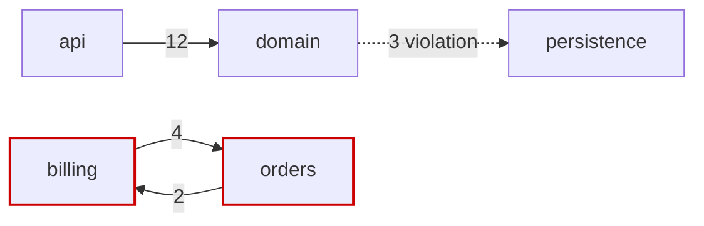

# Template: architecture review report (PR and repository variants)

*Use the PR variant (§B) for a single change and the repository variant (§C) for a whole codebase. Both use the finding
block in §A. Replace every `<placeholder>`; write "not checked" instead of leaving a field blank. Procedure and smell IDs:
[../references/review-playbook.md](../references/review-playbook.md). Recovery, evidence levels and metrics:
[../references/architecture-recovery-and-metrics.md](../references/architecture-recovery-and-metrics.md). Scenario
analysis and ATAM: [../references/evaluation-methods.md](../references/evaluation-methods.md). Preventive checks:
[../references/fitness-functions.md](../references/fitness-functions.md). ADRs: [adr.md](adr.md).*

---

## A. Finding block (shared)

*Severity: Blocker (must not merge/ship), Major, Minor, Nit. Confidence: Confirmed, Likely, Question (a Question is phrased
as a question and is never a Blocker). Evidence level: A tool-verified, B read in code, C inferred, D reported.*

````markdown
### ARCH-<nn> [<Blocker|Major|Minor|Nit> | <Confirmed|Likely|Question> | Effort <S|M|L>] <title: the problem, not the fix> (<smell ID from review-playbook §2, e.g. R5, or "new">)
- **Quality attribute / scenario:** <QA> · <scenario ID from the utility tree or PR, e.g. A2 "provider outage">
- **Evidence (level <A|B|C|D>):** `<path/File.ext:line-line>`, `<path:line>` (+ <N> similar sites)
  ```<lang>
  <<= 5 lines of code, or the command and a trimmed output excerpt>
  ```
- **What is wrong:** <1-3 sentences, impact first>
- **Why it matters:** <risk: the decision and its undesirable consequence> · <sensitivity point: the property the
  response depends on> · <tradeoff point, if any> · <which response measure fails>
- **Proposed fix:** <numbered steps> + <code, config or rule sketch>
- **Alternative:** <other fix, or "accept the risk"> — tradeoff: <what it costs>
- **Prevention:** <fitness function: tool + rule> · <ADR to write or update>
````

*One short example per severity (compress, but keep every field when writing real findings):*

**ARCH-01 [Blocker | Confirmed | Effort S] Refund endpoint has no server-side authorization (C1)**
- QA / scenario: Security · S1 "authenticated user tries to refund another user's order".
- Evidence (B): `api/src/services/refundService.ts:30-41` — `refund(orderId)` loads the order and refunds it with no
  ownership check; the only caller, `api/src/routes/refunds.ts:14-22`, passes `req.params.orderId` and no user.
- What is wrong: any logged-in user can refund any order. Why it matters: risk against S1; money loss and data integrity.
- Fix: change the signature to `refundService.refund(orderId, user)` and call `assertOwner(order, user)` (throws
  `ForbiddenError`, mapped to 403) inside the service; add a service test for the non-owner case. Alternative: enforce at
  the gateway — tradeoff: policy lives outside the code and is invisible to reviewers. Prevention: ADR "authorization
  lives in the service layer" plus a test that calls every mutating service method as a non-owner and expects
  `ForbiddenError`.

**ARCH-02 [Major | Confirmed | Effort S] Webhook dispatcher queues work without bound (R5)**
- QA / scenario: Performance, availability · P2 "10x webhook burst for 5 min; p99 dispatch < 1 s; no OOM".
- Evidence (A): `rg -n "Executors\.new(Fixed|Cached)ThreadPool" src/main` →
  `src/main/java/shop/webhooks/WebhookDispatcher.java:23` `Executors.newFixedThreadPool(8)`; that factory backs the
  pool with an unbounded `LinkedBlockingQueue`.
- Why it matters: risk — during a burst the queue grows without limit, so latency climbs and the heap can run out
  (P2 fails on both measures). Sensitivity point: queue capacity × pool size determines p99 latency and memory under
  burst. Tradeoff point: a bounded queue protects latency and memory but pushes back on or rejects producers.
- Fix: `new ThreadPoolExecutor(8, 8, 0L, TimeUnit.MILLISECONDS, new ArrayBlockingQueue<>(500),
  new ThreadPoolExecutor.CallerRunsPolicy())`; expose queue depth as a metric. Alternative: persist webhooks to a
  durable queue and dispatch from workers — tradeoff: another component to operate, but no loss on restart.
  Prevention: ArchUnit rule that only `shop.config` may call `Executors.newFixedThreadPool`/`newCachedThreadPool`.

**ARCH-03 [Minor | Confirmed | Effort S] Network module leaks OkHttp through its API (D7)**
- QA / scenario: Modifiability · M2 "replace the HTTP client by changing one module". Evidence (B):
  `core/network/build.gradle.kts:18` `api(libs.okhttp)` and `core/network/src/.../NetworkModule.kt:12`
  `fun client(): OkHttpClient`; 4 feature modules import `okhttp3.*` directly.
- Fix: switch to `implementation(libs.okhttp)` and expose a `HttpTransport` interface. Alternative: accept the leak
  and record it in an ADR — tradeoff: a client swap touches every feature module. Prevention: run the Gradle
  Dependency Analysis plugin (`com.autonomousapps.dependency-analysis`), which reports `api` declarations that should
  be `implementation`.

**ARCH-04 [Nit | Confirmed | Effort S] ADR-007 title says "Kafka" but decision is "outbox + Kafka" (E1)**
- QA: Modifiability (decision traceability). Evidence (B): `docs/adr/0007-events.md:1`. Fix: rename the title.

---

## B. PR variant (keep under ~40 lines)

```markdown
## Architecture review: <PR title> (<PR link>, head `<sha>`)
**Verdict:** <Approve | Approve with follow-ups | Request changes on architecture grounds> — <one-sentence reason>
*Rule: Request changes if any Blocker is Confirmed or Likely, or a Major breaks a stated scenario and has no agreed
follow-up. Approve with follow-ups if Majors or Minors remain, each with a linked ticket or ADR. Otherwise Approve.
Questions alone never block: ask them and approve conditionally.*

### Architectural impact
| New dependency edge (from -> to) | Allowed by <rule/ADR>? | Evidence |
|---|---|---|
| <module/package> -> <module/package> | <yes / no / no rule> | `<file:line>` |
- New modules/packages: <list or none> · API/contract changes: <endpoints, events, exported types; breaking?>
- Manifest dependencies: <added/upgraded libs in build.gradle.kts / package.json / pyproject / go.mod; scope>
- Architecture rules/tests touched: <added / modified / suppressed (file:line), e.g. new `ignore_imports` in
  `.importlinter`, wider allowlist in `.dependency-cruiser.js`, frozen-violation baseline grew> — a suppression needs
  a linked ADR or finding

### Findings (max ~7, severity order)
<ARCH-nn blocks from §A, compressed to title + evidence + fix + prevention>

### Decisions that deserve an ADR
- <decision> — <why it is architecturally significant>

### Out of scope (max 3, no action required in this PR)
- <observation> — <file:line>
```

*Inline comment format, one finding per comment, severity prefix first:*

```text
[Major] ARCH-02 (R5) Performance: newFixedThreadPool(8) queues webhooks without bound; a burst grows latency and
heap (P2). Suggest ThreadPoolExecutor with ArrayBlockingQueue(500) + CallerRunsPolicy and a queue-depth metric.
Alt: durable queue (more ops, no loss on restart).
```

---

## C. Repository variant

````markdown
# Architecture review: <system name>
<date> · commit `<sha>` · reviewer: <name> · depth: <skim | pass | deep dive>

## 1. Executive summary
- **Overall assessment:** <2-3 sentences: fit for the stated quality goals? biggest structural strength?>
- **Top 3 risks:** 1. <risk theme -> business impact> 2. <...> 3. <...>
- **Recommended next steps:** <3 actions, each with owner type and effort>

## 2. Scope and method
- Commit `<sha>`, branch `<name>`; modules in scope: <list>; out of scope: <list>
- Read: <entry points, composition root, build files, docs, ADRs>; Ran: <commands, see Appendix A>
- Tools (with versions): <e.g. jdeps 21, madge 8.x, import-linter 2.x, git log>; timebox: <hours>
- **Not verified:** <runtime behaviour, load, deployment config, ...>

## 3. Quality goals and business drivers
| Driver / goal | Source (doc, person, file) or ASSUMED | Measure |
|---|---|---|
| <e.g. checkout available during provider outage> | <README.md:12 / ASSUMED> | <p95, RTO, lead time ...> |

## 4. Intended architecture
- Source: <ADRs, docs/architecture.md, build rules> or "inferred from <package names / module layout>"
- Rules: <layer order, allowed edges, ownership of data stores, deployment units>

## 5. As-is architecture (recovered)
<Mermaid module graph, collapsed to top-level modules, edge counts as labels; mark cycles and violations>

- C&C: <processes, services, queues, connectors and protocols>
- Deployment: <artifacts, environments, data stores, external systems>

## 6. Intended vs actual
| Rule | Holds / Violated / Partial | Evidence (level, file:line or command) |
|---|---|---|
| <domain does not import framework X> | <Violated> | <A: `import-linter` contract "domain-pure" broken, 4 imports> |
- Reflexion: convergences <N> · divergences <N> (top 3 with counts) · absences <N> (expected edges missing)

## 7. Metrics and hotspots
| Module | LOC | Ca | Ce | I = Ce/(Ca+Ce) | A | D = abs(A+I-1) | In cycle? |
|---|---|---|---|---|---|---|---|
| <module> | | | | | | | <yes: SCC-1 / no> |

*State the tool and the unit (package, module or file) used to count Ca/Ce. Define A explicitly (e.g. interfaces +
abstract classes / total types) or write A and D as "n/a" where the language has no reliable abstract-type count
(Go interfaces are implicit; Python and TS depend on convention). Method and caveats:
[../references/architecture-recovery-and-metrics.md](../references/architecture-recovery-and-metrics.md).*

| Hotspot file (churn x complexity, 12 months) | Commits | Complexity proxy | Co-changes with (no static edge) |
|---|---|---|---|
| <path> | | | <path (N co-commits)> |

## 8. Utility tree
- <QA> -> <refinement> -> (<H|M|L> importance, <H|M|L> difficulty) <scenario ID>: <six-part scenario, one line>

## 9. Scenario analysis
| Scenario ID | Attribute | Environment | Stimulus | Response (measure) | Approaches / decisions | Sensitivity | Tradeoff | Risk | Non-risk (+ assumption) | Reasoning | Evidence file:line |
|---|---|---|---|---|---|---|---|---|---|---|---|

## 10. Findings (ranked: severity, confidence, cheapest fix first)
<ARCH-nn blocks from §A>
- **Non-risks:** <one line each: sound decision + evidence>

## 11. Risk themes
| Theme | Findings | Business goal threatened | Impact if unaddressed |
|---|---|---|---|
| <e.g. unbounded work under load> | ARCH-02, ARCH-05 | <driver from §3> | <outage, lost revenue, slower delivery> |

## 12. Roadmap (every step leaves main green and releasable)
| Horizon | Item | Findings | ADR | Fitness function | Effort |
|---|---|---|---|---|---|
| Now (this sprint) | <bound the dispatcher queue> | ARCH-02 | <ADR-nnn> | <rule/test> | S |
| Next (this quarter) | <strangle legacy module behind interface> | | | | M |
| Later | <split deployment unit> | | | | L |

## 13. Suggested ADRs
- ADR-<nnn>: <title> — <context in one line; options to compare> (use [adr.md](adr.md))

## 14. Assumptions and open questions
- ASSUMED: <assumption> — <how to confirm> · Question: <question> — <who can answer>

## Appendix A. Commands run
<command> — <purpose> — <exit status>

## Appendix B. Raw output
<trimmed tool output referenced by findings, with the command that produced it>

## Appendix C. Formal ATAM outputs (only when a full evaluation is requested)
- Architecture presentation · business goals · prioritized scenarios and utility tree · architectural approaches
- Risks and non-risks · sensitivity points · tradeoff points · risk themes linked to business drivers
- Mapping of approaches to the quality attributes they help or hurt
````

---

## D. Writing rules

- **Impact first:** lead each finding and the summary with the consequence for a quality goal, then evidence, then fix.
- **Every claim evidenced** with its level and file:line or command; no evidence, no finding (ask a Question instead).
  Level C/D evidence never supports a Blocker on its own.
- **Check library defaults before claiming an absence.** "No `timeout=`" is not "no timeout": httpx defaults to 5 s,
  while `requests` and Go's `http.Client{}` have none. Say which default applies and whether it meets the budget.
- **Name the tradeoff** of each fix and alternative; that is where sensitivity and tradeoff points show up.
- **Fewer, stronger findings:** merge duplicates and cite the count ("and 11 similar sites"); drop taste-only remarks.
- **Acknowledge non-risks briefly**, one line each; it calibrates trust in the rest.
- Name the code, not the person. No generic advice ("follow SOLID"). No attribution or generator lines in the report.
