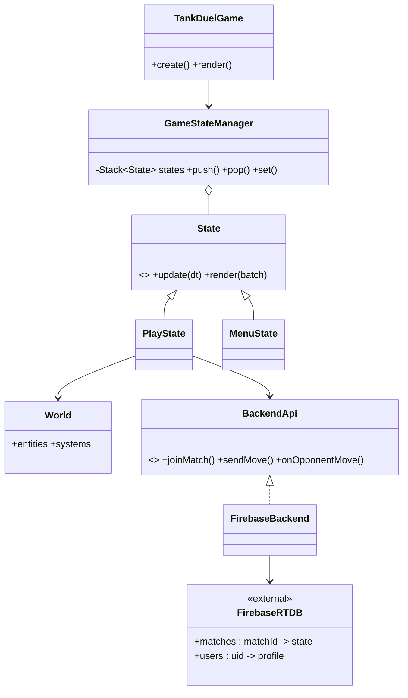
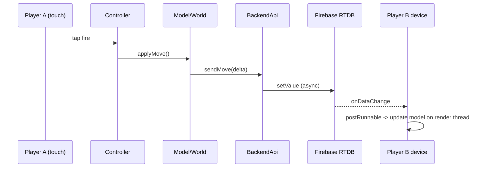
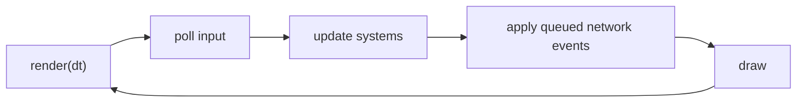
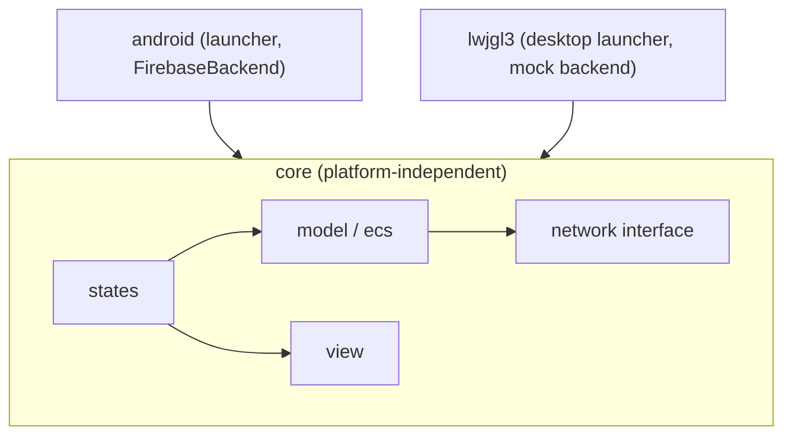
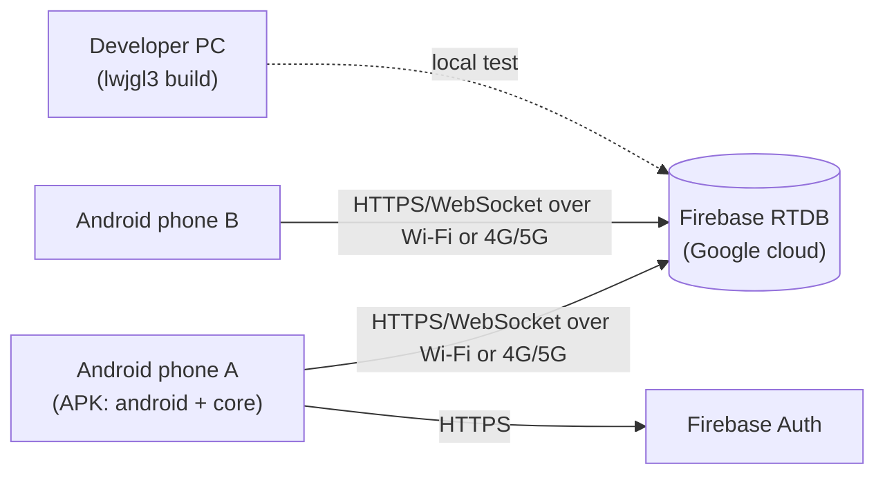

# Template: TDT4240 architecture document (IEEE 1471-aligned, 4+1 views)

> **The official template takes precedence.** If the course staff publish an
> architecture-document template or assignment text for your year (Blackboard or
> the course page), follow it. This file is an unofficial scaffold. Its section
> order matches recent public group documents and the teacher feedback they got.
> The required sections, page limits and deadlines may change from year to year.

How to use it: copy everything below the line, replace every `<...>`, and delete
the `<!-- guidance -->` comments before you hand it in. The small examples are for
a made-up libGDX + Firebase multiplayer game called "Tank Duel". Replace them.
Theory is in `../references/documentation.md` (views, IEEE 1471, 4+1) and in
`../references/quality-attributes-classic.md`, `../references/architectural-patterns.md`
and `../references/design-and-game-patterns.md`. Write the requirements first
(`requirements-document.md`). The ATAM evaluation of this document uses
`atam-evaluation.md`.

---

## Front page

| Field | Value |
|---|---|
| Game title | `<Tank Duel>` |
| Group number | `<Group NN>` |
| Members | `<Name 1, Name 2, ...>` |
| Chosen COTS | `<libGDX 1.x (gdx-liftoff), Firebase Realtime Database, Android SDK>` |
| Primary quality attribute | `<Modifiability>` |
| Secondary quality attributes | `<Performance, Usability>` |
| Document version / date | `<v1.0, YYYY-MM-DD>` |

<!-- Teacher feedback on public documents: the front page must show the game title and the chosen COTS. -->

## 1. Introduction

### 1.1 Purpose
`<This document describes the software architecture of Tank Duel. The group uses it to implement the game, and the evaluation group uses it for ATAM.>`

### 1.2 Scope
`<What the architecture covers (client game, backend usage, matchmaking) and what it leaves out (for example store publishing, monetisation).>`

### 1.3 Audience and structure
`<Readers: the development team, the course staff, the ATAM evaluation group. Give a one-line summary of each section.>`

### 1.4 Game concept (short)
`<Two to four sentences. Put the full concept in the requirements document.>`

## 2. Architectural drivers / architecturally significant requirements (ASRs)

<!-- Put only REQUIREMENTS here. "We use MVC" is a design decision and belongs in sections 6-7.
     Refer to the requirement IDs from the requirements document; do not restate them in full. -->

### 2.1 Functional drivers
| ID | Requirement | Why architecturally significant |
|---|---|---|
| `<FR1>` | `<Two players on different devices play the same match in real time>` | `<Forces client-server/backend state sync>` |
| `<FR5>` | `<Players can pick among game modes>` | `<Drives variation points in the game logic>` |

### 2.2 Quality drivers
| ID | QA | Scenario summary (full six-part scenario in the requirements doc) | Priority |
|---|---|---|---|
| `<M1>` | Modifiability | `<A developer adds a new game mode in under 8 person-hours, touching at most 3 classes>` | `<H>` |
| `<P1>` | Performance | `<An opponent's move appears on the other device within 500 ms on 4G>` | `<H>` |
| `<U1>` | Usability | `<A new player starts a match within 60 s of first launch>` | `<M>` |

### 2.3 Business drivers
`<e.g. Delivered within the course deadline by a team of N; must run on Android; free backend tier only; group has limited Kotlin/Java experience. Keep constraints (mandated by course/COTS) apart from decisions.>`

## 3. Stakeholders and concerns

| Stakeholder | Concerns | Addressed in |
|---|---|---|
| Players | Fun, responsiveness, easy start | 2.2 (P1, U1), 7.2 |
| Development team | Clear module split, easy to add features, low merge conflicts | 7.3, 6 |
| Course staff (examiners) | Architecture follows IEEE 1471; code matches architecture; clear rationale | All, 8, 9 |
| **ATAM evaluation group** | Understandable views; QA scenarios, tactics and rationale they can analyse | 2, 5, 6, 7, 9 |
| `<Backend provider (Firebase) / ops>` | `<Quota limits, security rules>` | `<7.1, 7.4>` |

<!-- Teacher feedback: the ATAM evaluation group must be listed as a stakeholder. -->

## 4. Architectural viewpoints

<!-- IEEE 1471: each viewpoint states stakeholders, concerns, notation and WHY it is included. -->

| Viewpoint | Stakeholders | Concerns | Notation | Why included |
|---|---|---|---|---|
| Logical | Developers, evaluators | Key abstractions, responsibilities, external services | UML class/component diagram | `<Shows how game logic is isolated from rendering and backend, the core of M1>` |
| Process | Developers, evaluators | Runtime interaction, concurrency, latency | UML sequence/activity diagram | `<Needed to reason about P1: the game loop and async backend callbacks>` |
| Development | Developers, course staff | Package/module structure, work split | UML package diagram | `<Lets 6 people work in parallel with few conflicts>` |
| Physical | Developers, evaluators | Devices, servers, network links | UML deployment diagram | `<Shows where latency and failure points are (device, 4G/Wi-Fi, Firebase)>` |

## 5. Architectural tactics

<!-- A tactic is a design decision that affects ONE quality attribute's response. Do NOT list
     patterns (MVC, Observer, State ...) here; they go in section 6. Name tactics as in SAiP. -->

| Tactic | QA | Where realised |
|---|---|---|
| Encapsulate (backend behind an interface) | Modifiability | `<BackendApi interface in core, implemented by FirebaseBackend in the android module>` |
| Increase semantic coherence | Modifiability | `<Each screen/state class has one responsibility>` |
| Defer binding (game-mode config loaded at start-up) | Modifiability | `<GameModeRegistry reads config file>` |
| Reduce overhead / manage sampling rate (send only state deltas at a fixed rate) | Performance | `<NetworkSync sends at 10 Hz>` |
| Maintain multiple copies of data (local cache of match state) | Performance | `<LocalMatchState>` |
| Support user initiative: cancel, pause/resume | Usability | `<PauseState, Cancel in matchmaking screen>` |
| `<Retry (for transient network faults)>` | `<Availability>` | `<NetworkSync>` |

## 6. Design and architectural patterns

<!-- Say the problem and the high-level use. Detailed classes go in the views (section 7). -->

| Problem | Pattern | High-level use |
|---|---|---|
| Keep game logic independent of rendering and input | MVC (architectural) | `<Model = world/entities, View = libGDX Screens, Controller = input handlers>` |
| Two devices share match state | Client-server (via Firebase) | `<Clients read and write the match node; Firebase relays changes>` |
| Screens switch between menu, lobby, game, game over | State (design) | `<GameStateManager holds the current state>` |
| Many entity types with shared behaviour | `<Entity Component System>` | `<Entities = IDs, components = data, systems = logic per frame>` |
| React to backend changes | Observer (design) | `<Listeners registered on match data>` |
| Create entities by type | Factory Method (design) | `<EntityFactory>` |

## 7. Architectural views

<!-- For each view: a diagram (primary presentation), a short element catalogue, and which tactics and
     patterns show up in it. Feedback asked for tactics and patterns to be visible in every view. -->

### 7.1 Logical view
Show the main classes and components, **including external services (e.g. Firebase) and the
server-side data structure**. If you use ECS, list the components and the systems that act on them.



| Element | Responsibility | Tactic / pattern |
|---|---|---|
| `<BackendApi>` | `<Hides the backend from core>` | `<Encapsulate; enables replacing Firebase>` |
| `<World>` | `<ECS container>` | `<ECS>` |

Server-side data: `<Sketch the database tree / collections, e.g. matches/{id}: {players, turn, state}>`.

### 7.2 Process view
Runtime interactions go here, not in the logical view: game loop, threads, async callbacks.





`<State which thread runs what: libGDX render thread vs Firebase callback threads, and how results
are moved back, e.g. Gdx.app.postRunnable. Note the frame-rate budget if P-scenarios need it.>`

### 7.3 Development view
Modules and packages, plus how the team splits work.



| Package / module | Owner(s) | Allowed dependencies |
|---|---|---|
| `<core/model>` | `<Name 1, Name 2>` | `<none outside core>` |
| `<android>` | `<Name 3>` | `<core>` |

`<Mention the build tool (Gradle), branch strategy, and the rule that core never imports Android or Firebase classes.>`

### 7.4 Physical view
Devices, servers and **network types**.



## 8. Consistency among views

<!-- IEEE 1471 asks you to record known inconsistencies. Show how elements map across views. -->

| Logical element | Process role | Development location | Physical node |
|---|---|---|---|
| `<PlayState>` | `<Runs on render thread>` | `<core/states>` | `<Phone>` |
| `<FirebaseBackend>` | `<Async callbacks>` | `<android/network>` | `<Phone -> Firebase>` |

Known inconsistencies: `<e.g. the desktop build uses a mock backend that is not in the physical view.>`

## 9. Architectural rationale

<!-- Tie every major structure to a tactic/pattern and to a QA goal. Say which alternatives you rejected. -->

| Decision | Tactic / pattern | QA goal served | Alternatives rejected (why) |
|---|---|---|---|
| `<Backend behind BackendApi>` | Encapsulate, Use an intermediary | M1 | `<Calling Firebase directly from states: couples core to Android>` |
| `<Send deltas at 10 Hz>` | Manage sampling rate | P1 | `<Sending the full state every frame: too much traffic>` |

Optional, Nygard-style ADR (a short format; check the course template allows it):

```markdown
### ADR-01: Hide the backend behind an interface in core
Status: Accepted
Context: M1 (modifiability) is the primary QA; Firebase is Android-only in our setup; the desktop build is needed for testing.
Decision: We will define BackendApi in core and implement it in the android module.
Consequences: + backend swappable, desktop mock possible; - one extra layer, callbacks must be marshalled to the render thread.
Alternatives rejected: direct Firebase calls (couples core to Android); own server (no time within the course).
```

## 10. Issues
`<Open problems, known risks, unresolved trade-offs, e.g. "Latency on 4G not yet measured".>`

## 11. Changes
| Date | Version | Change | Reason |
|---|---|---|---|
| `<YYYY-MM-DD>` | `<v1.1>` | `<Replaced X with Y>` | `<ATAM finding R2 / implementation>` |

## 12. Individual contributions
| Member | Contribution to this document |
|---|---|
| `<Name 1>` | `<Logical view, section 6>` |

## 13. References
<!-- Cite everything you use. Feedback on public documents: include references. -->
- Bass, L., Clements, P., Kazman, R. *Software Architecture in Practice*, 4th ed., Addison-Wesley, 2021. (3rd ed., 2013, uses different chapter numbers; cite the edition you read.)
- Kruchten, P. "The 4+1 View Model of Architecture." *IEEE Software* 12(6), 1995, pp. 42-50.
- IEEE Std 1471-2000, *Recommended Practice for Architectural Description of Software-Intensive Systems*.
- `<libGDX documentation, Firebase documentation, other sources you used>`

---

## Appendix (optional, beyond syllabus): mapping to arc42 / C4

Not part of the TDT4240 syllabus. Use only if readers expect an industry format. A real example that
combines arc42, C4, 4+1 and ADRs under ISO/IEC/IEEE 42010 (the successor to IEEE 1471):
https://gitlab.com/wallywallet/wallet/-/merge_requests/853.

| This template | arc42 section | C4 level | 4+1 |
|---|---|---|---|
| 1 Introduction, 2 Drivers | 1 Introduction and Goals, 2 Constraints | - | Scenarios (+1) |
| 2.2 Quality drivers | 10 Quality Requirements | - | Scenarios |
| 7.1 Logical view | 3 Context and Scope, 5 Building Block View | L1 Context, L3 Component | Logical |
| 7.3 Development view | 5 Building Block View | L2 Container | Development |
| 7.2 Process view | 6 Runtime View | Dynamic diagram | Process |
| 7.4 Physical view | 7 Deployment View | Deployment diagram | Physical |
| 9 Rationale / ADRs | 4 Solution Strategy, 9 Architecture Decisions | - | - |
| 10 Issues | 11 Risks and Technical Debt | - | - |

## Pre-submission checklist
- [ ] Front page has the game title and the chosen COTS.
- [ ] ASRs contain requirements only, no design decisions.
- [ ] The ATAM evaluation group is listed as a stakeholder.
- [ ] Every viewpoint says WHY it is included.
- [ ] No patterns are listed as tactics.
- [ ] The logical view shows external services and server-side data (and the ECS, if used).
- [ ] Runtime interactions are in the process view, not the logical view.
- [ ] The development view shows the work split; the physical view shows network types.
- [ ] Tactics and patterns are visible in the views; the rationale links them to QA goals.
- [ ] The code matches the documented architecture; references are included.
